# FT-Transformer: Architecture, Repository Implementation, and Thesis Methodology

## 1. Purpose and scope

This report explains the Feature Tokenizer Transformer (FT-Transformer) implemented in this repository, traces its complete data and training path, and records the claims that are supported by the committed source code and experiment artifacts.

The implementation is a local PyTorch version of the FT-Transformer introduced by Gorishniy et al. in *Revisiting Deep Learning Models for Tabular Data* (NeurIPS 2021) [1]. Its defining operation is to convert every scalar tabular feature into a learned vector token and then apply self-attention across the feature tokens belonging to one observation.

### Scope boundary that must remain explicit in the thesis

The trained FT-Transformer artifacts in this repository belong to the **CICIDS2017-DistriNet** pipeline:

- 79 numerical flow features;
- a binary head with two classes;
- a category head with five classes: `Benign`, `DoS`, `DDoS`, `Recon`, and `BruteForce`;
- train-fitted robust scaling;
- CICIDS2017-specific checkpoints and evaluations.

The model factory is generic in the number of input features and output classes, but this does not mean that an FT-Transformer has been trained for every dataset in the repository. In particular, the canonical **CICIoT2023** attack runner still lists only the MLP and CNN checkpoints in `MODEL_SPECS` ([`src/attack/run_all_models_attack_rerun.py`](src/attack/run_all_models_attack_rerun.py), lines 55–62). Therefore, CICIDS2017 FT-Transformer results must not be reported as CICIoT2023 results.

Within the CICIDS2017 branch, the situation is different: the classifier has trained binary and five-category checkpoints, is included in the CICIDS2017 victim rosters, and is included in the newer full adversarial evaluation. Dataset and experiment scope must therefore accompany every FT-Transformer result.

---

## 2. Source-code map

| Concern | Main file or artifact | Role |
|---|---|---|
| Architecture | [`src/classifiers/ft_transformer.py`](src/classifiers/ft_transformer.py) | Numerical tokenizer, CLS token, attention, ReGLU feed-forward network, Transformer block, head, model, optimizer groups, and default hyperparameters |
| Model registration | [`src/classifiers/models.py`](src/classifiers/models.py) | Registers `"ft_transformer"` in `get_model` |
| Training and clean evaluation | [`src/classifiers/cicids2017d_experiments.py`](src/classifiers/cicids2017d_experiments.py) | Data loading, class weights, training loop, optimizer, scheduler, early stopping, metrics, checkpoints, and reports |
| Dataset contract | [`src/datasets/cicids2017.py`](src/datasets/cicids2017.py) | Frozen 79-feature order, class order, train-fitted scaler, and split loading |
| Preprocessing provenance | [`data/processed/CICIDS_2017_Distrinet/preprocessing_manifest.json`](data/processed/CICIDS_2017_Distrinet/preprocessing_manifest.json) | Feature order, split policy, row counts, class counts, and train-only preprocessing record |
| Guarded victim loading | [`src/classifiers/cicids2017d_victims.py`](src/classifiers/cicids2017d_victims.py) | Reconstructs and freezes the five-class attack victim after schema and provenance checks |
| Generic attack loading | [`src/attack/adversarial_attacks.py`](src/attack/adversarial_attacks.py) | Infers the FT model type from checkpoint names and rebuilds it from checkpoint kwargs |
| CICIDS2017 attack integration | [`src/attack/run_cicids2017_primitive_attack.py`](src/attack/run_cicids2017_primitive_attack.py) | Includes `ft_transformer` in the CICIDS2017 victim roster |
| Full adversarial harness | [`scripts/run_full_adversarial_eval.py`](scripts/run_full_adversarial_eval.py) | Loads the FT category checkpoint and evaluates feature-space and primitive-domain attacks |
| Readiness smoke harness | [`scripts/ft_transformer_attack_readiness.py`](scripts/ft_transformer_attack_readiness.py) | Verifies logits, input gradients, feature order, PGD/C&W execution, and primitive-to-victim gradients |
| Architecture tests | [`src/classifiers/tests/test_ft_transformer.py`](src/classifiers/tests/test_ft_transformer.py) | Tests shapes, equations, gradients, serialization, schema rejection, and optimizer grouping |
| Shared model-contract test | [`src/classifiers/tests/test_models.py`](src/classifiers/tests/test_models.py) | Checks that the model factory returns finite class logits |
| Trained category metrics | [`outputs/cicids2017distrinet_ft/metrics/ft_transformer_category_metrics.json`](outputs/cicids2017distrinet_ft/metrics/ft_transformer_category_metrics.json) | Configuration, clean validation/test metrics, timing, and artifact paths |
| Trained binary metrics | [`outputs/cicids2017distrinet_ft/metrics/ft_transformer_binary_metrics.json`](outputs/cicids2017distrinet_ft/metrics/ft_transformer_binary_metrics.json) | Binary-head configuration and clean results |
| Run provenance | [`outputs/cicids2017distrinet_ft/classifier_run_manifest.json`](outputs/cicids2017distrinet_ft/classifier_run_manifest.json) | Dataset hashes, software versions, device, split sizes, class weights, and run configuration |

The architecture has no dependency on `rtdl` or `rtdl_revisiting_models`. It uses only local PyTorch modules. The architecture version persisted in checkpoint metadata is `ft_transformer.v1`.

---

## 3. Why feature tokenization is used

A conventional multilayer perceptron receives the entire flow vector as one flat tensor. FT-Transformer instead represents each feature as a separate token. Self-attention can then model pairwise and higher-order interactions among features, such as relationships among duration, packet counts, lengths, rates, and TCP flags.

For this implementation, a batch has the initial shape

\[
X \in \mathbb{R}^{B \times F},
\]

where $B$ is the batch size and $F=79$ for CICIDS2017-DistriNet. One row is one independent network flow. The token sequence is **not** a sequence of packets, time steps, or neighboring flows. Attention operates across columns within the same row.

This distinction is methodologically important:

- no temporal windows are constructed;
- no packet order is supplied to the model;
- no positional encoding is applied to the CICFlowMeter column order;
- rows are classified independently;
- feature identity is represented by feature-specific tokenizer parameters.

---

## 4. End-to-end forward path

```mermaid
flowchart LR
    A[RobustScaler-space flow<br/>B × 79] --> B[Element-wise asinh]
    B --> C[Numerical feature tokenizer<br/>B × 79 × 192]
    C --> D[Append learned CLS token<br/>B × 80 × 192]
    D --> E[PreNorm Transformer block 1]
    E --> F[PreNorm Transformer block 2]
    F --> G[PreNorm Transformer block 3]
    G --> H[Select final CLS vector<br/>B × 192]
    H --> I[LayerNorm → ReLU → Linear]
    I --> J[Raw logits<br/>B × K]
```



For the category model, $K=5$. For the binary model, $K=2$.

### 4.1 Input stabilization

The training factory passes `input_transform="asinh"`. The first model operation is therefore

\[
\tilde{x}_{b,j} = \operatorname{asinh}(x_{b,j}).
\]

This is an element-wise, monotonic, differentiable transform. It compresses large magnitudes while preserving sign and remains suitable for gradient-based attacks. It is applied **after** the external robust scaling because `X_train.npy`, `X_val.npy`, and `X_test.npy` already contain RobustScaler-space values.

The FT-Transformer does not load or fit a scaler internally. Consequently, supplying raw unscaled CICFlowMeter values directly to the classifier would violate the model contract.

The helper `_apply_input_transform` accepts only `None` and `"asinh"`; unsupported values raise `ValueError` immediately. The constructor validates the selected transform eagerly.

### 4.2 Numerical feature tokenizer

`NumericalFeatureTokenizer` stores two learned matrices:

\[
W^{\mathrm{tok}}, B^{\mathrm{tok}} \in \mathbb{R}^{F \times d},
\]

where $d=d_{\text{token}}=192$. For feature $j$ in row $b$, tokenization is

\[
T_{b,j,:} = B^{\mathrm{tok}}_{j,:} + \tilde{x}_{b,j}W^{\mathrm{tok}}_{j,:}.
\]

The implementation is the broadcasted PyTorch expression:

```python
x.unsqueeze(-1) * self.weight + self.bias
```

Its output shape is `[B, F, d_token]`. Every feature owns a different weight vector and bias vector. This is what identifies a token as, for example, `Flow Duration` rather than `SYN Flag Count`; no positional embedding is required for identity.

Tokenizer parameters are initialized uniformly in

\[
\left[-\frac{1}{\sqrt{d}},\frac{1}{\sqrt{d}}\right].
\]

The tokenizer validates that its input is two-dimensional and contains exactly the configured number of features.

### 4.3 Learned classification token

`CLSToken` contains one learned vector

\[
c \in \mathbb{R}^{d}.
\]

It is expanded across the batch and appended to the feature-token sequence:

\[
Z^{(0)} = [T_1,T_2,\ldots,T_F,c]
    \in \mathbb{R}^{B \times (F+1) \times d}.
\]

For the trained model, the sequence therefore has 80 tokens: 79 feature tokens and one final CLS token. The classifier head later reads only `tokens[:, -1]`, so the CLS vector acts as the learned summary of the flow.

### 4.4 Multi-head self-attention

Each block wraps `torch.nn.MultiheadAttention` with `batch_first=True`. With $d=192$ and eight attention heads, each head has width

\[
d_h = \frac{192}{8}=24.
\]

For a head $h$, the attention operation is conceptually

\[
Q_h=ZW_h^Q,\qquad K_h=ZW_h^K,\qquad V_h=ZW_h^V,
\]

\[
\operatorname{Attention}_h(Z)
=\operatorname{softmax}\left(\frac{Q_hK_h^\top}{\sqrt{24}}\right)V_h.
\]

All 80 tokens can attend to all 80 tokens. The model can therefore learn interactions between any pair of features and can update the CLS summary using information from the complete flow. Attention dropout is 0.2.

When `return_attention=False`, which is the normal training and inference path, the method returns only logits. When `return_attention=True`, each block requests attention weights and the model additionally returns a list containing one `[B, 80, 80]` matrix per block. PyTorch averages these returned weights across heads because `average_attn_weights=True`; the internal computation still uses eight separate heads.

### 4.5 Pre-normalized residual blocks

The model contains three `FTTransformerBlock` instances. Every block has two residual sublayers:

\[
Z' = Z + \operatorname{Dropout}_{r}
\left(\operatorname{MHSA}(\operatorname{Norm}_{a}(Z))\right),
\]

\[
Z^{\mathrm{next}} = Z' + \operatorname{Dropout}_{r}
\left(\operatorname{FFN}(\operatorname{LayerNorm}(Z'))\right).
\]

Residual dropout is configured as 0.0, so these residual branches are not stochastically dropped in the trained model. Attention dropout and FFN dropout remain active during training.

The first block follows the reference first-pre-normalization convention used by this implementation:

- block 1 uses `Identity` before attention;
- blocks 2 and 3 use `LayerNorm` before attention;
- all three blocks use `LayerNorm` before the feed-forward network.

This is controlled by `first_prenormalization=False`, the constructor default.

### 4.6 ReGLU feed-forward network

The feed-forward hidden width is

\[
d_{\mathrm{hidden}}
=\operatorname{round}\left(d\times\frac{4}{3}\right)
=\operatorname{round}(192\times 1.333\ldots)=256.
\]

The first linear layer produces $2d_{\mathrm{hidden}}=512$ values. `ReGLU` divides this vector into two equal halves $a$ and $b$ and computes

\[
\operatorname{ReGLU}([a,b])=a\odot\operatorname{ReLU}(b).
\]

The complete FFN is therefore

\[
\operatorname{FFN}(z)
=W_2\left(\operatorname{Dropout}_{0.1}
\left(a\odot\operatorname{ReLU}(b)\right)\right)+b_2,
\]

where $[a,b]=W_1z+b_1$. The output projection returns from width 256 to width 192 so that residual addition is valid.

`ReGLU` rejects an odd last dimension instead of silently producing an invalid split.

### 4.7 Classification head

After the final Transformer block, the model selects only the final CLS token and computes

\[
\ell = W_{\mathrm{head}}
\operatorname{ReLU}(\operatorname{LayerNorm}(z_{\mathrm{CLS}}))
+b_{\mathrm{head}}.
\]

The output $\ell\in\mathbb{R}^{B\times K}$ contains **raw logits**. Softmax is deliberately absent from the model:

- `CrossEntropyLoss` expects raw logits during training;
- evaluation applies softmax externally when probabilities are required;
- attacks can optimize logits without an unnecessary probability bottleneck.

---

## 5. Exact architecture and parameter count

### 5.1 Trained hyperparameters

| Hyperparameter | Repository value |
|---|---:|
| Numerical features | 79 |
| Transformer blocks | 3 |
| Token width | 192 |
| Attention heads | 8 |
| Width per head | 24 |
| Attention dropout | 0.2 |
| FFN hidden width | 256 |
| FFN multiplier | $4/3$ |
| FFN dropout | 0.1 |
| Residual dropout | 0.0 |
| First pre-attention normalization | Disabled in block 1 |
| Input transform | `asinh` |
| Category outputs | 5 |
| Binary outputs | 2 |
| Architecture tag | `ft_transformer.v1` |

These defaults are returned by `default_ft_transformer_kwargs`; `model_kwargs("ft_transformer")` adds `input_transform="asinh"` before model construction.

### 5.2 Parameter derivation

The committed category metrics report 922,949 trainable parameters. The source permits the total to be derived exactly:

| Component | Parameters |
|---|---:|
| Numerical tokenizer weights and biases: $2\times79\times192$ | 30,336 |
| CLS token | 192 |
| Block 1 attention | 148,224 |
| Block 1 FFN | 148,160 |
| Block 1 LayerNorm parameters | 384 |
| Block 1 total | 296,768 |
| Block 2 total, including two LayerNorms | 297,152 |
| Block 3 total, including two LayerNorms | 297,152 |
| Five-class head: LayerNorm plus `Linear(192,5)` | 1,349 |
| **Five-class total** | **922,949** |
| Two-class head: LayerNorm plus `Linear(192,2)` | 770 |
| **Two-class total** | **922,370** |

The category and binary models share the same tokenizer and Transformer body. Their 579-parameter difference comes entirely from the output layer.

### 5.3 Computational character

For each block, self-attention scales quadratically with the token count, approximately $O((F+1)^2d)$. Here, the sequence length is only 80, so the quadratic term is bounded and much smaller than it would be for long language or packet sequences. The cost is nevertheless higher than the repository’s MLP and CNN baselines, which is reflected in the FT-Transformer’s larger parameter count and training time.

---

## 6. Data and preprocessing contract

### 6.1 Features

The processed CICIDS2017-DistriNet matrix contains 79 model features in the exact order recorded by `preprocessing_manifest.json:modelling_feature_names`. The columns include ports, protocol, flow duration, packet and byte counts, packet-length statistics, rates, inter-arrival-time statistics, TCP flag counts, subflow features, window sizes, and active/idle statistics.

All 79 inputs are passed through the numerical tokenizer. There is no categorical token lookup. Even finite codes such as protocol and ports enter the trained classifier as robust-scaled numerical values.

### 6.2 Scaling

`sklearn.preprocessing.RobustScaler` is fitted on the 1,456,265 training rows only. The stored arrays are already transformed. The model then applies its differentiable `asinh` stabilizer. The effective forward input is therefore

\[
\operatorname{asinh}\left(\frac{x-\text{training median}}{\text{training IQR}}\right),
\]

subject to the exact behavior of the persisted `RobustScaler`.

The victim loader and attack code preserve this distinction:

- ordinary feature-space attacks operate on stored RobustScaler-space vectors;
- primitive-domain attacks modify pristine raw flow features and then apply `(raw - center) / scale` exactly once before calling the victim;
- the classifier itself performs no robust scaling.

### 6.3 Split protocol

The preprocessing manifest records chronological splitting within each retained source attack label, with no shuffle before assignment:

| Split | Ratio | Rows |
|---|---:|---:|
| Train | 70% | 1,456,265 |
| Validation | 15% | 312,058 |
| Test | 15% | 312,056 |

The reason for splitting within source labels is to preserve coverage of all retained attack subtypes while maintaining chronological order inside each subtype. Exact duplicates are removed before splitting, and preprocessing statistics are fitted on the training split.

The dataset manifest explicitly limits the claim: this is not a global forward-time or independent attack-campaign generalization experiment.

### 6.4 Labels

Two heads are trained independently:

- binary: `Benign=0`, `Attack=1`;
- category: `Benign=0`, `DoS=1`, `DDoS=2`, `Recon=3`, `BruteForce=4`.

`load_data` validates the committed label encoders, checks row alignment, requires all expected labels in every split, verifies that binary labels equal `(category != 0)`, rejects non-finite features, and requires exactly 79 columns.

---

## 7. Training implementation

### 7.1 Reproducibility controls

Before each model/head training run, `set_seed` seeds Python, NumPy, CPU PyTorch, and all CUDA devices. cuDNN benchmarking is disabled and deterministic mode is enabled. The training `DataLoader` receives a separately seeded `torch.Generator`; training is shuffled, whereas validation and test loaders are not.

The recorded training seed is 42. This is a **single trained model seed**, so clean classifier metrics do not support a mean-and-standard-deviation claim across independently trained models.

### 7.2 Loss and imbalance handling

The loss is weighted multiclass cross-entropy:

\[
\mathcal{L}
=-\frac{1}{B}\sum_{i=1}^{B}w_{y_i}
\log\frac{\exp(\ell_{i,y_i})}
{\sum_{k=1}^{K}\exp(\ell_{i,k})}.
\]

For the committed run, balanced class weights are computed from training labels only:

\[
w_c=\frac{N_{\mathrm{train}}}{K N_c}.
\]

The five-category weights persisted in the run manifest are:

| Class | Weight |
|---|---:|
| Benign | 0.252510 |
| DoS | 2.425229 |
| DDoS | 4.375270 |
| Recon | 2.616570 |
| BruteForce | 59.903950 |

The large BruteForce weight reflects its rarity in the training data. No resampling or adversarial training is performed.

### 7.3 Optimizer and weight-decay groups

FT-Transformer uses AdamW, unlike the MLP/CNN branch, which uses Adam. The committed FT settings are:

- learning rate: $10^{-4}$;
- decoupled weight decay: $10^{-5}$;
- batch size: 2,048;
- gradient norm clipping: 5.0;
- full-precision training; the code contains no automatic mixed-precision path.

`optimization_param_groups` divides trainable parameters into two disjoint groups.

**Weight decay applies to:**

- attention projection matrices;
- FFN projection matrices;
- classification-head projection weights.

**Weight decay is disabled for:**

- tokenizer weights and biases;
- the CLS token;
- all LayerNorm parameters;
- all named bias parameters;
- any other one-dimensional parameter.

This protects embedding-like, normalization, and offset parameters while regularizing the main matrix projections.

### 7.4 Epoch loop

For every training batch, the implementation executes:

1. move feature and label tensors to the selected device;
2. clear gradients using `optimizer.zero_grad(set_to_none=True)`;
3. obtain raw logits from the model;
4. calculate weighted cross-entropy;
5. backpropagate;
6. clip the total parameter-gradient norm to 5.0;
7. update parameters with AdamW;
8. accumulate training loss and accuracy.

After each epoch, validation probabilities and loss are computed under `torch.inference_mode()`. The reporting function then computes accuracy, balanced accuracy, macro F1, weighted F1, per-class precision/recall/F1/support, and a confusion matrix.

### 7.5 Learning-rate schedule and checkpoint selection

The scheduler is `ReduceLROnPlateau` with:

- monitored quantity: validation macro F1;
- mode: maximize;
- patience: 1;
- multiplicative factor: 0.5.

The best checkpoint is selected by validation macro F1. If macro F1 ties within $10^{-12}$, the lower validation loss wins. The test split is not used for checkpoint selection.

Early stopping counts epochs without checkpoint improvement and stops when the configured patience is reached. For the committed experiment, the command overrode the script’s generic CLI defaults and used 10 requested epochs with patience 3:

- binary head: six epochs completed, best epoch 3;
- category head: ten epochs completed, best epoch 7.

This distinction matters for reproducibility: the parser defaults are five epochs and patience two, but those are not the settings that produced the committed FT checkpoints.

### 7.6 Post-training evaluation

After training:

1. the best CPU-cloned state is loaded back into the model;
2. validation and untouched test metrics are computed;
3. the checkpoint and history are written;
4. the model is rebuilt from the saved architecture arguments;
5. the saved state is loaded strictly;
6. up to 32 test rows are passed through the reloaded model;
7. output shape and finiteness are asserted.

The run manifest records `checkpoint_reload_verified=true`.

---

## 8. Checkpoint and provenance design

Each `.pt` checkpoint is a dictionary with the following top-level fields:

- `state_dict`;
- `model_type`;
- `model_kwargs`;
- `num_features`;
- `num_classes`;
- `metadata`.

The metadata includes:

- display and model names;
- `architecture_version`;
- input feature count and ordered feature names;
- class count, class names, and label mapping;
- task name;
- architecture kwargs;
- optimizer, learning rate, and weight decay;
- seed, batch size, requested/completed epochs, and best epoch;
- best validation macro F1;
- class-weighting method and gradient clipping norm;
- scaler description;
- dataset and split identifiers;
- SHA-256 digest of the preprocessing manifest.

The architecture is reconstructed from `model_kwargs`, not inferred from tensor sizes. `strict=True` state loading catches architecture and feature-count mismatches.

### Guarded category-victim loading

`load_category_victim` adds experiment-level guards before an FT-Transformer is used as a white-box victim:

1. require the checkpoint file;
2. require the expected class order;
3. hash the current preprocessing manifest;
4. require the sibling classifier run manifest;
5. compare the run-manifest preprocessing hash with the current dataset hash;
6. compare class order and feature count;
7. require the checkpoint’s structural keys;
8. verify `model_type`, `num_features`, and `num_classes`;
9. reconstruct the model from saved kwargs;
10. load the state strictly and switch to evaluation mode;
11. freeze parameter gradients.

Freezing parameters does **not** block gradients with respect to inputs. This allows PGD, C&W, latent attacks, and primitive-domain attacks to differentiate through the victim while avoiding unnecessary parameter-gradient storage.

---

## 9. Adversarial-attack integration

All operations in the forward path are differentiable with respect to the input: robust-scaled input values pass through `asinh`, affine tokenization, attention, ReGLU, residual paths, and the linear head. There is no detach, rounding, `argmax`, NumPy conversion, or inference-only context inside `forward`.

The repository checks this at several levels:

- unit tests require finite, nonzero input gradients;
- a finite-difference test compares numerical and autograd derivatives;
- the readiness harness runs untargeted PGD and C&W;
- the readiness harness optimizes a targeted-Benign objective with label 0;
- the readiness harness differentiates from primitive controls through raw-feature generation, one scaler application, and the FT-Transformer loss;
- the newer full CICIDS2017 adversarial harness includes the FT category checkpoint alongside MLP and CNN.

The current dataset-specific status is:

| Pipeline | FT-Transformer status |
|---|---|
| CICIDS2017-DistriNet classifier training | Implemented; binary and category checkpoints exist |
| CICIDS2017-DistriNet clean evaluation | Implemented; committed metrics exist |
| CICIDS2017-DistriNet readiness smoke | Implemented; gradient and attack paths are exercised |
| CICIDS2017-DistriNet full adversarial evaluation | Included in the newer full evaluation harness and report |
| Canonical CICIoT2023 all-model attack rerun | Not included; roster remains MLP and CNN |

Attack seeds in the full adversarial evaluation represent repeated attack runs or attack initializations against the same trained checkpoint. They are not independent classifier-training seeds.

---

## 10. Verification coverage

`test_ft_transformer.py` verifies the following behavioral properties:

- the exact tokenizer equation and output dimensions;
- independent parameters for different features;
- correct CLS expansion and append position;
- preservation of sequence and token dimensions by a block;
- omission of the first block’s pre-attention LayerNorm;
- exact ReGLU behavior and rejection of odd dimensions;
- finite raw logits with the required shape;
- model-factory registration and default architecture values;
- parameter gradients under multiclass cross-entropy;
- finite, nonzero input gradients;
- agreement of autograd with finite differences;
- CPU and optional CUDA execution;
- deterministic evaluation after a state-dict round trip;
- rejection of incorrect input dimensions;
- rejection of incompatible checkpoint shapes;
- batch-size-one inference;
- complete, non-overlapping AdamW parameter grouping;
- expected default hyperparameters.

`test_models.py` independently includes `ft_transformer` in the shared neural-classifier contract: a tabular batch must produce one finite logit vector per row.

These tests establish implementation contracts. They do not replace evaluation on the untouched test split and do not establish robustness by themselves.

---

## 11. Recorded clean experimental results

### 11.1 Five-category classifier

The committed category checkpoint was trained on an NVIDIA GeForce RTX 4070 Ti SUPER with Python 3.11.15 and PyTorch 2.5.1+cu121. The run used seed 42, ten requested epochs, patience three, and selected epoch seven.

| Test metric | Value |
|---|---:|
| Test rows | 312,056 |
| Loss | 0.151714 |
| Accuracy | 0.984580 |
| Balanced accuracy | 0.990988 |
| Macro F1 | 0.977961 |
| Weighted F1 | 0.985137 |
| Training time | 1,523.18 s |
| Test inference time | 7.91 s |

Per-class test performance:

| Class | Precision | Recall | F1 | Support |
|---|---:|---:|---:|---:|
| Benign | 0.998773 | 0.981741 | 0.990184 | 247,164 |
| DoS | 0.999882 | 0.991800 | 0.995825 | 25,733 |
| DDoS | 1.000000 | 0.999439 | 0.999720 | 14,265 |
| Recon | 0.840625 | 0.997317 | 0.912291 | 23,852 |
| BruteForce | 0.999026 | 0.984645 | 0.991783 | 1,042 |

The dominant category error is `Benign → Recon`: 4,510 test flows. This explains the lower Recon precision despite high Recon recall.

The best validation macro F1 is 0.879592, considerably lower than the test macro F1. The category training history also shows training accuracy above 0.999 by epoch two while validation performance is substantially lower and validation loss oscillates. The defensible interpretation is that validation-based checkpoint selection controls an overfitting tendency; the result is not evidence that the test split was used for tuning.

### 11.2 Binary classifier

| Test metric | Value |
|---|---:|
| Test rows | 312,056 |
| Loss | 0.141601 |
| Accuracy | 0.984551 |
| Balanced accuracy | 0.988395 |
| Macro F1 | 0.977087 |
| Weighted F1 | 0.984726 |
| Best epoch | 3 |
| Epochs completed | 6 |
| Training time | 918.60 s |

### 11.3 Comparison claim

The repository’s same-split category results report macro F1 values of 0.977251 for SimpleMLP, 0.975278 for CNNOnly, and 0.977961 for FT-Transformer. These differences are small. The evidence supports **clean-performance parity with architectural diversity**, not a broad claim that FT-Transformer is superior.

---

## 12. Implementation choices and limitations

### 12.1 Local implementation rather than an external package

The model is implemented directly with PyTorch modules. This keeps checkpoint behavior auditable and avoids an additional package dependency. It also means that claims should refer to this repository’s `ft_transformer.v1` implementation rather than assuming every detail of a particular external `rtdl` release.

### 12.2 Numerical-only specialization

The original FT-Transformer family supports both numerical and categorical tokenization. This repository’s processed CICIDS2017 input is entirely numerical, so only numerical tokenization is implemented. Protocol and port fields are not categorical embeddings.

### 12.3 No temporal semantics

Self-attention is across features within one flow. The implementation must not be described as learning packet order, session history, or time-series dependencies. No recurrent state, temporal position, or cross-flow context exists.

### 12.4 No positional encoding

Feature identity comes from each feature’s own tokenizer weight and bias. The frozen column order remains critical because row $j$ of the tokenizer parameters is permanently associated with feature $j$.

### 12.5 Input-space contract

The trained model expects robust-scaled vectors and applies `asinh` internally. A second external scaling operation or direct raw-feature input would change the learned decision function. Attacks that start in raw space must transform once before classification.

### 12.6 Single model-training seed

The clean results come from one seed. Repeated attack seeds do not quantify classifier-training variance. Any thesis table should report the clean numbers as single-run values unless independently trained FT checkpoints are added.

### 12.7 Dataset-specific generalization

The split is chronological within source attack labels and retains all supported labels in each split. This is a leakage-conscious closed-set design, but the preprocessing manifest explicitly does not claim global forward-time or independent-campaign generalization.

### 12.8 Attention weights are not explanations by default

The optional returned matrices expose average attention weights, but the code does not perform an attribution validation. Attention magnitude alone should not be presented as causal feature importance without a separate interpretability study.

### 12.9 Clean accuracy is not robustness

High test accuracy and valid input gradients establish classifier quality and attack compatibility, not adversarial robustness. Robustness claims must use the relevant attack result, denominator, validity gate, realizability gate, and dataset name.

---

## 13. Thesis-ready methodology text

The following text can be adapted directly into a methodology chapter.

> A Feature Tokenizer Transformer (FT-Transformer) was implemented locally in PyTorch as an additional neural intrusion-detection architecture for the CICIDS2017-DistriNet experiment. Each observation was treated as an independent 79-dimensional flow-level vector. The train-fitted RobustScaler representation was passed through an element-wise inverse hyperbolic sine transform and then converted into feature tokens. For numerical feature $j$, the tokenizer computed $T_j=b_j+x_jW_j$, where $W_j$ and $b_j$ were feature-specific learnable vectors of width 192. Consequently, feature identity was encoded by tokenizer parameters rather than by positional encodings.
>
> A learned classification token was appended to the 79 feature tokens, producing an 80-token sequence. The sequence was processed by three pre-normalized Transformer blocks with eight-head self-attention. Each attention head had width 24. The feed-forward sublayer used a ReGLU activation with hidden width 256, attention dropout 0.2, feed-forward dropout 0.1, and residual dropout 0.0. Following the final block, only the classification-token representation was passed through LayerNorm, ReLU, and a linear classification layer. The model returned raw logits for either the binary or five-category task. The five-category model contained 922,949 trainable parameters.
>
> The classifier was optimized with AdamW using a learning rate of $10^{-4}$ and weight decay of $10^{-5}$. Weight decay was excluded from tokenizer parameters, the classification token, biases, and LayerNorm parameters. Class imbalance was handled with inverse-frequency cross-entropy weights computed exclusively from the training labels. Training used batches of 2,048 flows and gradient-norm clipping at 5.0. A `ReduceLROnPlateau` scheduler monitored validation macro F1. Model selection maximized validation macro F1, using validation loss only as a tie-breaker, and early stopping used a patience of three epochs. The test split was reserved for final evaluation.
>
> The category checkpoint was trained with seed 42 and selected at epoch seven. On the untouched 312,056-row test split, it achieved 0.984580 accuracy, 0.990988 balanced accuracy, 0.977961 macro F1, and 0.985137 weighted F1. These results were comparable to the MLP and CNN baselines rather than decisively superior. The principal category error was confusion of benign traffic with reconnaissance traffic.
>
> The model’s forward path remained differentiable with respect to all input features. Checkpoint loading froze model parameters while retaining input gradients, allowing the classifier to serve as a white-box adversarial victim. Schema guards verified the 79-feature order, five-class order, model type, checkpoint dimensions, and preprocessing-manifest hash before attack evaluation.

---

## 14. Claims supported and claims to avoid

### Supported

- The repository contains a local, dependency-free PyTorch FT-Transformer implementation.
- CICIDS2017-DistriNet features are tokenized separately and attended within each flow.
- The trained architecture uses three blocks, width 192, eight heads, ReGLU FFNs, and a CLS-only head.
- The category and binary checkpoints were trained with train-only class weights and preprocessing statistics.
- The category model has 922,949 trainable parameters and achieved 0.977961 test macro F1 on the committed split.
- The model provides finite input gradients and can act as a differentiable white-box victim.
- The newer CICIDS2017 full adversarial harness includes FT-Transformer.
- The canonical CICIoT2023 all-model rerun does not currently include FT-Transformer.

### Avoid

- “FT-Transformer models temporal packet sequences.”
- “Protocol is represented by a categorical embedding.”
- “The model fits or applies RobustScaler internally.”
- “Attention weights prove causal feature importance.”
- “FT-Transformer is universally superior to MLP, CNN, or tree models.”
- “Clean accuracy demonstrates adversarial robustness.”
- “The clean metrics are averaged over multiple model-training seeds.”
- “The CICIDS2017 FT checkpoint is an evaluated CICIoT2023 victim.”
- “Attack-seed variance is equivalent to classifier-training variance.”

---

## 15. Reproduction commands

Training both CICIDS2017 heads with the settings used by the committed FT run:

```bash
python -m src.classifiers.cicids2017d_experiments \
    --models ft_transformer \
    --tasks all \
    --epochs 10 \
    --patience 3 \
    --batch-size 2048 \
    --ft-learning-rate 1e-4 \
    --ft-weight-decay 1e-5 \
    --class-weighting balanced \
    --seed 42 \
    --device cuda \
    --output-dir outputs/cicids2017distrinet_ft
```

Architecture and gradient tests:

```bash
python -m pytest src/classifiers/tests/test_ft_transformer.py src/classifiers/tests/test_models.py -q
```

Attack-readiness smoke test:

```bash
python scripts/ft_transformer_attack_readiness.py \
    --victim outputs/cicids2017distrinet_ft/models/ft_transformer_category.pt \
    --device cuda \
    --n 256
```

On shells that do not already expose the repository source root, set `PYTHONPATH=src` as required by the local environment.

> Re-running the classifier trainer recreates the selected output directory’s `models`, `metrics`, `predictions`, `plots`, `histories`, and `logs` subdirectories. Use a separate output directory when preserving existing checkpoints.

---

## References

[1] Y. Gorishniy, I. Rubachev, V. Khrulkov, and A. Babenko, “Revisiting Deep Learning Models for Tabular Data,” *Advances in Neural Information Processing Systems*, vol. 34, 2021. [Official paper page](https://papers.nips.cc/paper/2021/hash/9d86d83f925f2149e9edb0ac3b49229c-Abstract.html); [paper PDF](https://proceedings.neurips.cc/paper/2021/file/9d86d83f925f2149e9edb0ac3b49229c-Paper.pdf).

[2] Repository implementation: [`src/classifiers/ft_transformer.py`](src/classifiers/ft_transformer.py), architecture version `ft_transformer.v1`.

[3] Training and evaluation implementation: [`src/classifiers/cicids2017d_experiments.py`](src/classifiers/cicids2017d_experiments.py).

[4] Committed CICIDS2017-DistriNet FT run: [`outputs/cicids2017distrinet_ft/classifier_run_manifest.json`](outputs/cicids2017distrinet_ft/classifier_run_manifest.json) and [`outputs/cicids2017distrinet_ft/metrics/ft_transformer_category_metrics.json`](outputs/cicids2017distrinet_ft/metrics/ft_transformer_category_metrics.json).
