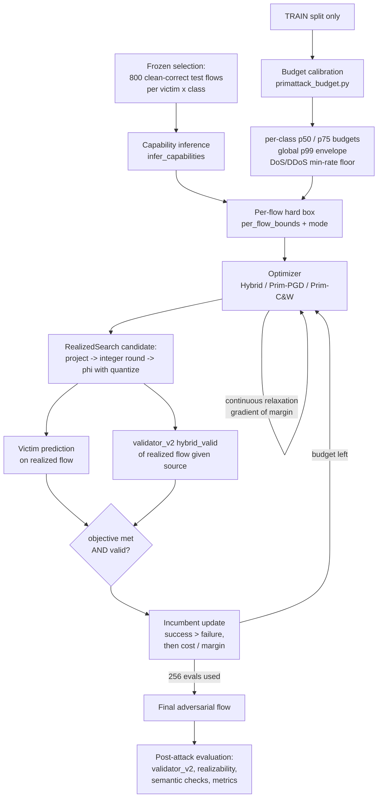

# PrimAttack Explained: Workflow and Attack Flow

This document explains PrimAttack end to end, for the thesis report. It follows the code, not an
idealised description. Configurations are the locked FINAL-suite settings
(`FINAL_OUTPUTS/00_PROTOCOL.md`), as run by `scripts/run_final_suite.py` →
`scripts/run_primattack_optimizer_ablation.py`. Since amendment A2, PrimAttack is
capability-aware.

---

## 1. What PrimAttack is

PrimAttack is a white-box evasion attack on flow-based NIDS classifiers. It does not edit
classifier features directly. Instead it searches over a small set of attacker-controllable
traffic primitives, and a deterministic model of the flow extractor turns every choice into a
complete, consistent 79-feature flow:

| Control | Meaning | Units / type | Direction |
|---|---|---|---|
| $p$ | padding added to every forward packet | integer bytes per forward packet | increase only |
| $D$ (`delay`) | total extra forward inter-arrival time | integer microseconds | increase only |
| $s$ (`shape`) | how $D$ is distributed over the forward gaps: $s = 0$ proportional to the existing gaps, $s = 1$ equal per gap | continuous, $[0,1]$ | — |

The attacker never writes a CICFlowMeter feature directly. Every changed feature is recomputed
from $(p, D, s)$ by the canonical transform $\varphi$
(`attack/realizability/cicids2017.py:CICIDS2017PrimitiveModel.generate`). This is the
difference from feature-space attacks (PGD, C&W, CAPGD, C-PGD). Those move features
independently, so they can reach combinations that no padding or delay could produce.

**Threat model.** White-box access to the victim's gradients. The attacker controls only the
forward direction: it can make its own packets larger and send them later. It cannot remove
bytes, add or remove packets, change flags, ports or protocol, or touch the backward
(server-to-client) direction. Success is measured on the realized flow, i.e. after integer
rounding, and the flow must pass validator_v2.

---

## 2. Pipeline overview

The attack runs once for each (dataset, victim, source class, budget, primitive mode, attack
seed, optimizer).

---

## 3. Step 0: train-only budget calibration (offline)

`src/attack/primattack_budget.py:calibrate` reads **only** `X_train_pristine.npy` and
`y_train_cat.npy`. It never sees validation or test flows, victim predictions or attack
success; the artifact records this in `selection_prohibited_inputs`. The artifacts are
`artifacts/primattack/budget_calibration.json` (CICIDS2017) and
`artifacts/primattack/budget_calibration_cicids2018.json`.

For each attack class (DoS, DDoS, Recon, BruteForce) it computes three things.

1. **Budget levels** at train quantiles p25 (`restricted`), p50 (`intermediate`) and p75
   (`maximum-evaluated`):
   - **Padding cap** $p_{\max}$: the quantile of the class's positive `Fwd Packet Length Mean`,
     rounded to a whole byte. In words, padding may add up to about as much as a typical
     forward packet of that class already carries.
   - **Timing cap** $r_{\max}$ (`max_relative_duration_change`): the quantile of
     $|\text{Flow Duration} - \text{class median}| / \text{class median}$. This is how much
     durations naturally vary within the class. The added delay is then limited to
     $D \le r_{\max} \cdot \text{Flow Duration}$.
2. **Plausibility envelope**: the train p99 of 9 features, computed over the whole training
   split and shared by all classes: Fwd Packet Length Max, Min and Mean; Total Length of Fwd
   Packet; Fwd IAT Total, Max, Std and Mean; Flow Duration. Adversarial values must stay at or
   below these upper bounds.
3. **Semantic thresholds**: the class train p05 of `Flow Packets/s` and the p99 of
   `Flow Duration`. For DoS and DDoS, rate retention is required. A DoS flow slowed below the
   class's 5th-percentile packet rate would no longer be a credible DoS flow, so the minimum
   rate also caps the delay.

**Calibrated values** (padding in bytes per forward packet; timing as the maximum relative
increase in duration):

| Dataset | Class | p50 $p_{\max}$ | p50 $r_{\max}$ | p75 $p_{\max}$ | p75 $r_{\max}$ | Min Flow Packets/s |
|---|---|---|---|---|---|---|
| CICIDS2017 | DoS | 47 | 0.567 | 54 | 1.268 | 0.625 |
| CICIDS2017 | DDoS | 2 | 0.435 | 3 | 0.687 | 1.065 |
| CICIDS2017 | Recon | 2 | 0.213 | 10 | 0.532 | — |
| CICIDS2017 | BruteForce | 12 | 0.120 | 91 | 0.234 | — |
| CICIDS2018 | DoS | 69 | 0.266 | 74 | 0.517 | 10.331 |
| CICIDS2018 | DDoS | 58 | 0.809 | 63 | 1.427 | 0.265 |
| CICIDS2018 | Recon | 22 | 0.991 | 50 | 0.991 | — |
| CICIDS2018 | BruteForce | 84 | 0.039 | 85 | 0.079 | — |

The FINAL suite uses p50, p75 and **unbounded**. The p25 level exists but is not used.

**Unbounded ("envelope-only")** (`unbounded_calibration`) sets $p_{\max} = r_{\max} = \infty$.
It keeps the same p99 envelope and the same DoS/DDoS rate floor. The primitives are then
limited only by physical plausibility, not by the class quantile budget.

---

## 4. Step 1: frozen source flows

The baselines stage creates one canonical list per (dataset, victim, class) and freezes it:
800 test flows, drawn with a seeded uniform rule (selection seed 42) from the flows the victim
already classifies correctly. It is stored in
`FINAL_OUTPUTS/runs/<dataset>/baselines_untargeted/selection.json`. The PrimAttack runner:

- reloads this list and checks its SHA-256;
- checks that each sample ID maps to the stored positional index;
- re-predicts the rows and aborts unless every row has the source class label and is still
  classified correctly by the victim.

All methods (PrimAttack and the baselines) therefore attack exactly the same flows, which is
what makes paired McNemar tests possible.

---

## 5. Step 2: capability inference (amendment A2)

`CICIDS2017PrimitiveModel.infer_capabilities(raw)` decides **per flow, before any
optimisation,** which primitives are physically meaningful:

$$
\texttt{pad\_allowed} = (N_f \ge 1) \wedge (\text{TotLenFwd} > 0) \wedge (\text{FwdLenMean} > 0) \wedge (\text{FwdLenMin} > 0)
$$

$$
\texttt{timing\_allowed} = (N_f \ge 2) \wedge (\text{Fwd IAT Total} > 0)
$$

**Padding.** Padding adds $p$ bytes to *every* forward packet. If `Fwd Packet Length Min = 0`,
the flow has at least one empty forward packet (e.g. a pure ACK). Padding it would *insert
payload into an empty packet* rather than lengthen an existing payload, and aggregate features
do not say which packet is the empty one. Such flows are therefore attacked **timing-only**.
Each flow gets a reason code: `NO_FORWARD_PAYLOAD`, `INSUFFICIENT_FWD_PACKETS`,
`EMPTY_FWD_PACKET` or `PAD_ALLOWED`.

**Timing.** Timing needs at least one forward gap to stretch. The reason codes are
`SINGLE_FWD_PACKET`, `ZERO_TIMING_HEADROOM` and `TIMING_ALLOWED`.

**Consequence in the FINAL suite.** Only 0.03% (CICIDS2017) and 0.38% (CICIDS2018) of attacked
flows are allowed to pad. **Every valid PrimAttack success is timing-only**
(`FINAL_OUTPUTS/final_experiment_summary.md`).

---

## 6. Step 3: per-flow hard box

`per_flow_bounds(raw, calibration, capabilities)` turns the class budget into a hard box per
flow, $0 \le p \le p^{hi}$, $0 \le D \le D^{hi}$, $0 \le s \le s^{hi}$. Every point in this box
is feasible without any soft penalty.

**Padding upper bound.** The class cap and all envelope headrooms must hold, and padding is
zeroed if the flow may not pad:

$$
p^{hi} = \texttt{pad\_allowed} \cdot \operatorname{clip}_{[0,\,p_{\max}]}\min\Big(
E_{\text{FwdMax}} - \text{FwdMax},\;
E_{\text{FwdMin}} - \text{FwdMin},\;
E_{\text{FwdMean}} - \text{FwdMean},\;
\tfrac{E_{\text{TotLenFwd}} - \text{TotLenFwd}}{N_f}\Big)
$$

**Delay upper bound.** The minimum of:

- the class relative budget: $r_{\max} \cdot \max(\text{Flow Duration}, 0.5\,\mu s)$;
- envelope headroom on Fwd IAT Total, Flow Duration, and $(N_f - 1) \times$ the Fwd IAT Mean
  headroom;
- headroom on Fwd IAT Max and Fwd IAT Std, each divided by the **worst-case** coefficient over
  all $s \in [0,1]$, so that every shape in the box is feasible;
- for DoS and DDoS only, the rate floor:
  $\text{Duration} + D \le N \cdot 10^6 / \text{minRate}$, where $N$ is the total packet count.

The result is multiplied by `timing_allowed`. The shape bound is $s^{hi} = 1$ if timing is
allowed, else 0.

**Primitive modes** (`_apply_primitive_mode`):

- `joint`: both primitives (the default).
- `timing-only`: sets $p^{hi} = 0$.
- `padding-only`: sets $D^{hi} = s^{hi} = 0$.

After this, each row falls into its own effective search space (`row_primitive_modes`):
`joint`, `timing-only`, `padding-only`, or `no-primitive` (the flow stays unchanged). A control
with less than one integer unit of headroom is pinned at 0 and is not an optimisation variable.

---

## 7. Step 4: the canonical transform $\varphi$

`generate(raw, controls, quantize)` maps a source flow $x$ and controls $(p, D, s)$ to the
adversarial flow $x' = \varphi(x; p, D, s)$. Rows with $p = D = 0$ are returned bit-for-bit
unchanged. Notation: $N_f$ forward packets, $N_b$ backward packets, $N = N_f + N_b$, and
$g = \max(N_f - 1, 1)$ forward gaps.

### 7.1 Padding block (written only when $p > 0$)

| Feature | New value |
|---|---|
| Total Length of Fwd Packet | $\text{TL}_f' = \text{TL}_f + N_f\,p$ |
| Fwd Packet Length Min / Max | $\min + p$, $\max + p$ |
| Fwd Packet Length Mean, Fwd Segment Size Avg | $\text{TL}_f' / N_f$ |
| Fwd Packet Length Std | unchanged (a uniform shift preserves the standard deviation) |
| Packet Length Max / Min | combined forward/backward extreme, branching on whether each direction has packets |
| Packet Length Mean, Average Packet Size | $(\text{TL}_f' + \text{TL}_b)/N$ |
| Packet Length Variance / Std | exact pooled sample variance of the forward and backward blocks, and its square root |

### 7.2 Timing block (written only when $D > 0$)

The delay is split into a part proportional to the existing gaps and a part added equally to
each gap:

$$
a = 1 + \frac{(1-s)\,D}{\text{FIT}_0}, \qquad b = \frac{s\,D}{g}
$$

Each forward gap becomes $a \cdot \text{gap} + b$. Summed over all gaps this adds exactly
$(1-s)D + sD = D$.

| Feature | New value |
|---|---|
| Fwd IAT Total | $\text{FIT}_0 + D$ |
| Fwd IAT Max / Min | $a\cdot\max_0 + b$, $a\cdot\min_0 + b$ |
| Fwd IAT Std | $a \cdot \text{std}_0$ (the uniform offset does not change the spread) |
| Fwd IAT Mean | $\text{FIT}' / g$ |
| Flow Duration | $\max(\text{Dur}_0 + D,\ \text{FIT}',\ \text{Bwd IAT Total},\ 0.5\,\mu s)$ |
| Flow IAT Max | $\text{FlowIATMax}_0 + (\text{Dur}' - \text{Dur}_0)$ (conservative) |
| Flow IAT Mean | $\text{Dur}' / (N - 1)$ |

### 7.3 Rates

Fwd, Bwd and Flow Packets/s are recomputed from the new duration when $D > 0$. Flow Bytes/s is
recomputed when $p > 0$ or $D > 0$.

### 7.4 Quantization

With `quantize=True`, integer outputs are rounded: total forward length, forward min/max,
Fwd IAT Total/Max/Min, Flow Duration, Flow IAT Max. Means, standard deviations and rates are
then recomputed from the rounded values. The adversarial flow therefore satisfies the same
integer and identity constraints as a genuine CICFlowMeter row.

### 7.5 What stays fixed

- Everything outside the 23-feature write support: counts, flags, ports, protocol, backward
  statistics, header/window fields.
- Features that *would* change under real packet edits but cannot be reconstructed from
  aggregates (role `LEVEL_C`): Fwd Act Data Pkts, Subflow Fwd Bytes, bulk statistics,
  Flow IAT Std and Min, and all Active/Idle statistics. These are held constant, not claimed
  invariant. This is a stated claim boundary.

The runner asserts that no feature outside the 23-feature support ever changes.

---

## 8. Step 5: `RealizedSearch`, the shared search harness

All three optimizers run inside one `RealizedSearch` object (`attack/primitive_optimizer.py`).
It owns the attack space, the success definition and the query accounting, so the optimizers
cannot differ on any of them.

**Normalised controls.** The optimizers work on $q \in [0,1]^3$, with
$p = q_1 p^{hi}$, $D = q_2 D^{hi}$, $s = q_3 s^{hi}$. Coordinates with no headroom are
masked to 0.

**Scoring a candidate (the realized path).** For a requested $(p, D, s)$:

1. **Project**: $p \leftarrow \min(\operatorname{round}(p), \lfloor p^{hi} \rfloor)$, and the
   same for $D$ with integer µs; clamp $s$. Zero out primitives the flow may not use, and set
   $s = 0$ if $D = 0$.
2. **Realize**: $x' = \varphi(x; \text{projected}, \texttt{quantize=True})$.
3. **Predict**: victim logits on $(x' - \text{median}) / \text{IQR}$.
4. **Gate**: $V = \texttt{hybrid\_valid}(x' \mid x)$ from validator_v2 (`hybrid_valid_gate`).
   This includes the source-conditioned rule `PROTO_0080`.
5. **Success** = objective met on the realized flow **and** $V$.

**Objective and margin** (lower is better; negative means the objective is met):

- Targeted → Benign: $\text{margin} = \max_{j\neq 0} z_j - z_0$. Hit when $\arg\max = 0$.
- Untargeted: $\text{margin} = z_y - \max_{j\neq y} z_j$. Hit when $\arg\max \neq y$.

**Incumbent (the best candidate kept per flow)**
(`_candidate_take`):

1. A success always replaces a failure.
2. Among successes, keep the one with the lowest normalised primitive cost
   $p/p^{hi} + D/D^{hi}$; ties go to the lower margin.
3. Among failures, keep the one with the lowest margin.

**Evaluation budget.** Every victim forward pass counts, whether on a realized flow or on the
surrogate. The per-flow cap is $B = 256$. The identity (unmodified) flow is scored first, at a
cost of 1. Each gradient step costs 2 (one surrogate forward with its backward pass, plus one
realized evaluation), and a row stops once it cannot afford another step.

**Continuous surrogate for gradients.** Rounding has no useful gradient, so gradients come from
$\varphi$ with `quantize=False`, evaluated at $\max(q, 10^{-3})$ on free coordinates with a
straight-through gradient. The floor is needed because $\varphi$ copies the flow unchanged
at exactly $p = 0$ or $D = 0$, which would give an exactly-zero gradient. Pinned coordinates
have their gradient path cut (amendment A1 fixed non-finite gradients there). Only realized,
quantized flows can ever become the incumbent.

---

## 9. Step 6: the three optimizers

All three optimizers share `RealizedSearch`, the box and the budget $B = 256$.

### 9.1 Hybrid Search (`optimize_primitive_candidates`)

1. **Exact padding enumeration.** For flows that may pad, try $p = 1, 2, \dots,
   \lfloor p^{hi}\rfloor$ with $D = 0$, in increasing order of cost, in batches. A flow stops
   at its first success, since larger padding can only cost more. This solves padding-only
   rows exactly. In the FINAL suite almost no flow may pad, so this stage is almost always
   skipped at zero cost.
2. **Adaptive refinement** for flows that are still unsuccessful and have delay headroom.
   Restarts continue until the budget is used up (`restarts=None`). Restart 0 starts from the
   best point found so far; later restarts start uniformly at random in the box. Each step:
   1. Compute the gradient of the margin on the surrogate, and normalise it by the mean
      absolute gradient over the free coordinates.
   2. Momentum: $v \leftarrow 0.75\,v + g$.
   3. Step: $q \leftarrow \operatorname{clip}_{[0,1]}(q - \eta \operatorname{sign}(v))$, then
      mask pinned coordinates.
   4. Score the new $q$ on the realized path.
   5. Every $\max(5, T/4) = 10$ steps, for flows whose best margin in this restart has not
      improved: halve $\eta$, reset $q$ to the restart's best point and clear the momentum.

   Locked: $T = 40$ steps per restart, $\eta_0 = 0.1$.

### 9.2 Prim-PGD (`optimize_primitive_pgd`)

This is fixed-step projected sign-momentum descent on the margin, without enumeration, step
adaptation or reset to the best point:

- restart 0 starts at the clean flow ($q = 0$); restarts 1 and 2 start uniformly at random in
  the box;
- update: $v \leftarrow 0.75\,v + g/\bar{|g|}$, then
  $q \leftarrow \operatorname{clip}(q - 0.05\,\operatorname{sign}(v))$, then score on the
  realized path.

Locked: 3 restarts × 42 steps ($= \lfloor (256-1)/(2\cdot 3) \rfloor$), step 0.05,
momentum 0.75.

### 9.3 Prim-C&W (`optimize_primitive_cw`)

This is projected Adam on

$$
\mathcal{L}(q) = \underbrace{q_p + q_D}_{\text{primitive cost}} + c \cdot \max(\text{margin} + \kappa, 0),
$$

with a per-flow binary search over $c$, as in Carlini & Wagner:

- each stage restarts from the clean flow;
- after a stage with a realized success, $c$ moves towards the lower bracket;
- otherwise $c$ is multiplied by 10, or bisected once an upper bracket exists.

Locked: 3 stages × 42 Adam steps, lr 0.5 (chosen on the validation split), $c_0 = 1$,
$\kappa = 0$, betas (0.9, 0.999).

### 9.4 Optimizer selection (Exp B, pre-registered)

The rule: pick the highest aggregate **Valid Targeted ASR at p75**, pooled over both datasets,
all victims, classes and seeds (sum of valid successes / sum of attempts). Ties go to fewer
mean victim evaluations per flow, then to the fixed order Hybrid, Prim-PGD, Prim-C&W. p-values
play no role.

The outcome: Hybrid and Prim-PGD tie exactly (1,752 / 57,600 valid targeted successes). Almost
every row is timing-only, so Hybrid's padding stage never runs and both reduce to similar
sign-momentum searches over delay and shape. **Prim-PGD is selected** because it used fewer
evaluations (188.5 vs 189.6 mean per flow).

---

## 10. Step 7: post-attack evaluation

The incumbent adversarial flow is re-evaluated independently of the search
(`evaluate_cell` + `FlowSemanticValidator.evaluate`).

| Gate | Checker | What it checks |
|---|---|---|
| Raw success | victim | targeted: $\arg\max = $ Benign; untargeted: $\arg\max \neq y$ |
| `validator_pass` (`hybrid_valid`) | validator_v2 | SCHEMA ∧ EXTRACTOR ∧ PROTOCOL ∧ MINED, given the source flow |
| `realizable` | `RealizabilityValidator` | the model's own identities, packet-length ordering, non-negative rates, integer features integral, frozen features unchanged |
| `primitive_feasible` | `FlowSemanticValidator` ∧ realizable | projected $p$, $D$ are integers inside the box; $s \in [0, s^{hi}]$; relative duration change ≤ budget; bytes not decreased |
| `semantic_pass` | `FlowSemanticValidator` | label, protocol, ports, packet counts, flags and IP endpoints unchanged; values finite; only the dependencies of active primitives changed; the class rule |

**Class rules:**

- **DoS and DDoS**: Flow Packets/s must stay at or above the class train p05.
- **Recon and BruteForce**: the critical properties (scanned port set and scan order;
  authentication attempts and outcomes) are recorded as `NOT_TESTABLE` from flow data, so
  these classes can never reach semantic status `PASS`.

**Metrics** (all over the same $N = 800$ attempted flows per victim and class):

$$
\text{ASR}_{\text{raw}} \;\supseteq\; \text{ASR}_{\text{valid}} = \tfrac{1}{N}\textstyle\sum S_i V_i \;\supseteq\; \text{ASR}_{\text{prim-feasible}} \;\supseteq\; \text{SP-ASR}
$$

It follows from the class rules that SP-ASR is 0 by construction for Recon and BruteForce.

**Integrity checks inside the runner.** The runner aborts if:

- any output value is non-finite;
- any feature outside the 23-feature support changed;
- padding was applied to a flow without padding capability;
- an empty forward packet was filled.

It also records for every row whether the search's own success flag agrees with the recomputed
final success (`incumbent_final_mismatch`). Per-row `.npz` files store the final adversarial raw
flow, the controls, the box, costs, evaluation counts, candidate source, failure reason
(`success` / `invalid` / `exhausted` / `no_headroom`) and the capability reason codes. The
analyzer later recomputes validator_v2 and the victim predictions from the stored flows and
aborts on any mismatch.

---

## 11. Where PrimAttack sits in the FINAL suite

| Stage | Experiment | PrimAttack configuration |
|---|---|---|
| `primattack_targeted_optimizers` | B | Hybrid / Prim-PGD / Prim-C&W, targeted → Benign, p75, joint |
| optimizer selection | B | pre-registered rule → Prim-PGD |
| `primattack_targeted_budgets` | C | top-2 optimizers at p50 and unbounded (p75 cells reused from B) |
| `primattack_untargeted` | A, D | selected optimizer, untargeted, p75 (+ unbounded, descriptive) |
| `primattack_untargeted_modes` | A (primitive ablation) | the same configuration restricted to timing-only and padding-only |

In every stage: attack seeds 42, 2024, 2026; classes DoS, DDoS, Recon, BruteForce; victims
MLP, CNN, FT-Transformer (the CICIDS2018 victims are the training-seed-42 checkpoints).

**Headline numbers** (`FINAL_OUTPUTS/final_experiment_summary.md`). Untargeted Valid ASR,
Prim-PGD, p75:

| Victim | CICIDS2017 | CICIDS2018 |
|---|---|---|
| MLP | 4.09% | 2.53% |
| CNN | 13.47% | 1.16% |
| FT-Transformer | 0.12% | 0.00% |

- **Validity gap.** Raw ASR equals Valid ASR in every cell with successes. This contrasts with PGD/C&W
  (53.59–100% raw → 0% valid) and CAPGD/C-PGD-PrimSupport (large raw, little or no valid).
- **Budget sensitivity (Exp C).** Valid Targeted ASR never decreases as the budget grows. The
  unbounded timing box raises it, for example from 4.09% to 22.94% (CICIDS2017 MLP) and from
  13.25% to 59.69% (CICIDS2017 CNN). The p75 figure is a conservative result at a calibrated
  budget, not a bound on timing-based evasion.
- **Effect of amendment A2.** The pre-fix relaxed-padding run reached 11.06% / 36.67% / 0.50%
  Valid ASR on CICIDS2017, but mostly by filling empty forward packets. It is kept only as a
  non-canonical record in `FINAL_OUTPUTS/superseded_relaxed_padding/`.

---

## 12. How PrimAttack differs from the baselines

| Aspect | PrimAttack | PGD / C&W | CAPGD / C-PGD-PrimSupport |
|---|---|---|---|
| Variables | 3 controls $(p, D, s)$ | 79 features | 23 features directly |
| Feature coupling | every dependent feature recomputed by $\varphi$ | none | a few encoded relations (penalty; CAPGD also repairs) |
| Discreteness | integer bytes and µs; realized flow quantized | ignored | integer truncation at the end |
| Per-flow capability | padding only where physically meaningful | none | none |
| Budget | train-calibrated per class + p99 envelope + rate floor | $\varepsilon$-ball | $\varepsilon$-ball + train box |
| Sees validator_v2 during search | **yes** (part of the success predicate) | no | no |

The last row is a deliberate threat-model difference and is documented in the protocol.
PrimAttack is a validity-aware search; the baselines are evaluated for validity only afterwards.

---

## 13. Claim boundaries

- **Feature-space proxy.** All results are proxies on aggregate CICFlowMeter features. No PCAP
  is edited, replayed or re-extracted (`attack/realizability/base.py:NullPacketBackend`).
  Packet-level realizability and complete malicious functionality are **not** claimed.
- **Held-constant features.** Level-C features (Flow IAT Std/Min, Active/Idle, bulk, subflow,
  Fwd Act Data Pkts) are held constant because aggregates cannot say how they would change.
  They are not shown to be invariant.
- **Conservative padding rule.** Requiring `Fwd Packet Length Min > 0` gives up possibly
  legitimate padding of data packets in flows that mix empty and data packets.
- **Recon and BruteForce semantics** are not testable from flow data.
- **Victim dependence.** Valid evasion depends on the victim and the budget. The
  FT-Transformer stays at or below 0.59% under any PrimAttack budget.
- **Seeds** are attack seeds on one frozen victim per architecture, not victim-training seeds.
  Report each victim separately and never pool them.

---

## 14. Code map

| Concern | File |
|---|---|
| Budget calibration (train only) | `src/attack/primattack_budget.py` |
| Primitive specs, capabilities, box, projection, $\varphi$ | `src/attack/realizability/cicids2017.py` (`CICIDS2017PrimitiveModel`) |
| 23-feature write support | `src/attack/realizability/cicids2017.py:primattack_joint_feature_mask` |
| Search harness + Hybrid / Prim-PGD / Prim-C&W | `src/attack/primitive_optimizer.py` |
| Primitive modes, cell evaluation | `src/attack/run_cicids2017_primitive_attack.py` (`_apply_primitive_mode`, `evaluate_cell`) |
| Internal realizability checks | `src/attack/realizability/validator.py` |
| Semantic and primitive-feasibility checks | `src/attack/flow_semantics.py` |
| validator_v2 gate | `validation/attack_interface.py:structural_masks`, `primitive_optimizer.py:hybrid_valid_gate` |
| FINAL runner | `scripts/run_primattack_optimizer_ablation.py` (driven by `scripts/run_final_suite.py`) |
| Analysis | `scripts/analyze_final_suite.py` → `FINAL_OUTPUTS/` |
