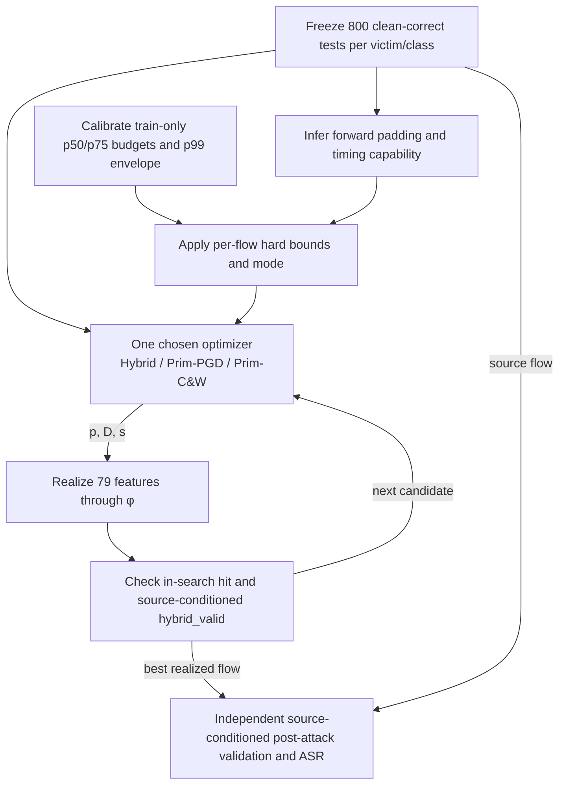
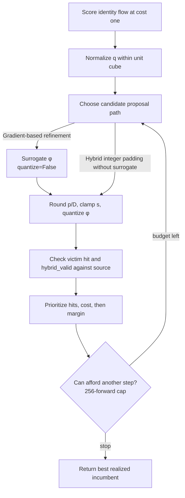

## 1. End-to-end pipeline

Train-only bounds include a DoS/DDoS rate floor. Frozen FINAL flows undergo capability-aware search; independent post-attack checks report nested raw, valid, primitive-feasible, and SP-ASR.

## 2. RealizedSearch

Hybrid can enumerate integer padding without surrogate gradients. Free-coordinate floors support straight-through gradients; surrogate and realized forwards count toward 256. Failures rank by margin, and only realized candidates become incumbents.
