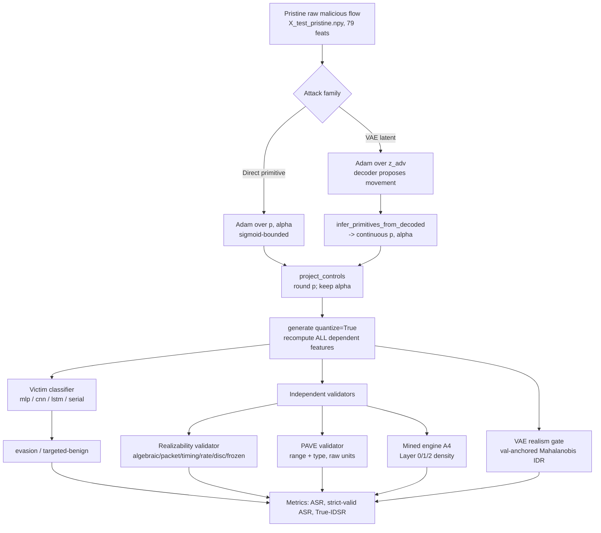

# Adversarial Attack System — Master Documentation

This folder is a **complete, self-contained explanation** of the CICIDS2017-DistriNet
adversarial-attack subsystem used in this thesis: the *primitive-control attacks*, the
*validators*, and *Conditional Feature Freedom (CFF)*. It is written so that you can read
your own code back to yourself, reconstruct every experiment, and defend every number in
the report.

Everything here is grounded in the actual source files. Every seed, threshold, tolerance,
and training hyper-parameter cited below is copied out of the code, not invented.

---

## 0. What the thesis actually does (one paragraph)

We take **real malicious network flows** from CICIDS2017-DistriNet, and try to make a set
of trained intrusion-detection classifiers (the *victims*) label them as **Benign**, while
keeping the modified flow **physically realizable** and **statistically realistic**. The
core idea is that an attacker cannot freely edit all 79 CICFlowMeter features — most are
*derived* from a few controllable quantities. So instead of perturbing 79 numbers, the
attack perturbs **two attacker-controllable primitives per flow** (`p` = forward
packet-length padding, `alpha` = forward timing dilation), and a differentiable
*realizability layer* deterministically recomputes every dependent feature. Success is only
counted after (a) discrete projection, (b) full dependency recomputation, (c) three
**independent** validators, and (d) a VAE-based realism gate.

---

## 2. The document set (read in this order)

| # | File | What it explains |
|---|------|------------------|
| 1 | [`01_cff_conditional_feature_freedom.md`](01_cff_conditional_feature_freedom.md) | CFF: how we *rank which features are perturbable* from train data only |
| 2 | [`02_constraint_discovery.md`](02_constraint_discovery.md) | **How every constraint is discovered** (mined density rules, robust tails, algebraic identities, derivations) — all on TRAIN only |
| 3 | [`03_constraint_engine_and_layers.md`](03_constraint_engine_and_layers.md) | Layer 0/1/2 engine: projector, soft penalties, independent validation |
| 4 | [`04_masks.md`](04_masks.md) | `DatasetMask` (perturbable / derived / frozen partition) and CFF `.npy` masks |
| 5 | [`05_realizability_model.md`](05_realizability_model.md) | `CICIDS2017PrimitiveModel`: the differentiable `(p, alpha) -> 79 features` map |
| 6 | [`06_validators.md`](06_validators.md) | Realizability validator, PAVE validator, structural validator; how *strict validity* / IDR / True-IDSR compose |
| 7 | [`07_primitive_attack.md`](07_primitive_attack.md) | The **direct primitive-domain attack** runner, step by step |
| 8 | [`08_vae_latent_primitive_attack.md`](08_vae_latent_primitive_attack.md) | The **VAE latent-space** primitive-constrained attack (the proposed method) |
| 9 | [`09_attack_pipeline_and_rows.md`](09_attack_pipeline_and_rows.md) | End-to-end pipeline, **which rows are used and how they are picked**, seeds, VAE/victim training configs, provenance, metrics, baselines |

---

## 3. The attack pipeline at a glance

The single most important design rule: **the generator only enforces universal/structural
realizability; the density validators and the realism gate are never embedded into the
generator.** That is why a 100% realizability rate does not automatically imply a high
PAVE/mined validity or a high IDR — the three are measured independently (thesis separation
requirement, `attack/realizability/validator.py` docstring lines 16-18).

---

## 4. Global determinism and seeds (single source of truth)

| Scope | Seed | Where |
|-------|------|-------|
| Global repo seed | `SEED = 42` | `config/paths.py` (imported by CFF as `config.paths.SEED`) |
| Attack optimization seeds | `42, 43, 44` | `--seeds` default in every attack runner |
| Row-sampling seed (test rows) | `42 + class_id` | `_class_rows(...)` — **fixed across the 42/43/44 attack seeds** so optimization variance is isolated from sampling variance |
| Stage-A per-class VAE seed | `42` | `StageAConfig.seed` |
| Stage-B residual head sampling | `142 + class_id` | `_class_x(train, ..., 142 + class_id)` (masked runner) |
| CFF sampling / LightGBM | `42` (`--seed`, `default_rng(42)`, `KFold(random_state=42)`) | `conditional_feature_freedom.py` |

`experiments/provenance.py::deterministic_runtime(seed)` seeds `random`, `numpy`,
`torch`, and CUDA, sets `cudnn.deterministic=True`, `cudnn.benchmark=False`, and
`torch.use_deterministic_algorithms(True, warn_only=True)`. Every attack seed calls it.

---

## 5. Fixed vocabulary (used throughout)

- **Dataset:** `cicids2017_distrinet`, 79 CICFlowMeter features in the frozen order stored
  in `preprocessing_manifest.json:modelling_feature_names`.
- **Classes (category encoder order):** `Benign=0, DoS=1, DDoS=2, Recon=3, BruteForce=4`.
- **Attack classes:** `ATTACK_CLASSES = (DoS, DDoS, Recon, BruteForce)` — the four with a
  per-class Stage-A VAE. (`Benign` is the *target*, never attacked.)
- **Victims:** `mlp, cnn, lstm, serial` (custom PyTorch models loaded via
  `classifiers/cicids2017d_victims.py::load_category_victim`).
- **Primitives:** `p` (forward packet-length augmentation, bytes, integer, identity 0) and
  `alpha` (forward timing dilation, ratio, >= 1, identity 1).
- **Threat model:** targeted `Attack -> Benign` (untargeted evasion also reported).
- **Denominator:** clean-correct malicious test rows per `(class, victim)`.
- **Strict validity (primitive/latent):** `PAVE ∧ mined ∧ realizable`.
- **True-IDSR:** `evasion-to-benign ∧ strict-valid ∧ in-distribution` (the honest success
  metric; misclassification alone is not enough).

---

## 6. Source-file index (what lives where)

| Concern | File(s) |
|---|---|
| Direct primitive attack runner | `src/attack/run_cicids2017_primitive_attack.py` |
| VAE latent primitive attack (algorithm) | `src/attack/vae_latent_primitive.py` |
| VAE latent primitive attack (runner) | `src/attack/run_cicids2017_vae_latent_attack.py` |
| Input-space PGD baseline | `src/attack/run_cicids2017_input_baseline.py` |
| Masked VAE attack ladder A1–A6 | `src/attack/run_cicids2017_vae_attacks.py` |
| Realizability model (`p, alpha` map) | `src/attack/realizability/cicids2017.py` |
| Realizability contracts / roles | `src/attack/realizability/base.py` |
| Realizability validator | `src/attack/realizability/validator.py` |
| PAVE validator | `src/evaluation/pave_style_validator.py` |
| Structural validator (CICIoT) | `src/attack/validator.py` |
| Constraint engine / layers | `src/constraints/{engine,layer0,layer1,layer2,base,registry}.py` |
| Mined Layer-2 rules | `constraints/cicids2017_distrinet/mined.json` |
| Perturbation masks | `src/attack/masks/{base,cicids2017_distrinet}.py` |
| CFF | `src/preprocessing/conditional_feature_freedom.py` |
| Ablation ladder A0–A6 | `src/experiments/ablations.py` |
| Provenance / seeds | `src/experiments/provenance.py` |
| Stage-A per-class VAE training | `src/vae/cicids2017_stage_a.py` |
| Victim loading | `src/classifiers/cicids2017d_victims.py` |
| Dataset adapter (manifest/transform/splits) | `src/datasets/cicids2017.py` |

> Note on scope: this documentation set covers the **CICIDS2017-DistriNet** attack family
> (the recent, active work). The repository also contains an older CICIoT2023 pipeline;
> `src/attack/validator.py` is the CICIoT2023 structural validator and is documented in
> [`06_validators.md`](06_validators.md) for completeness.
