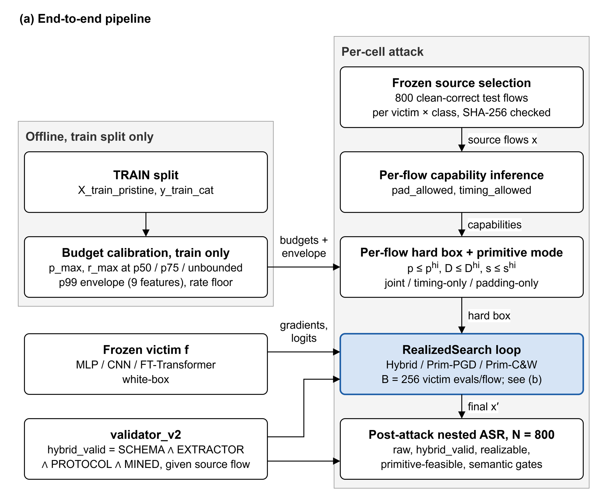
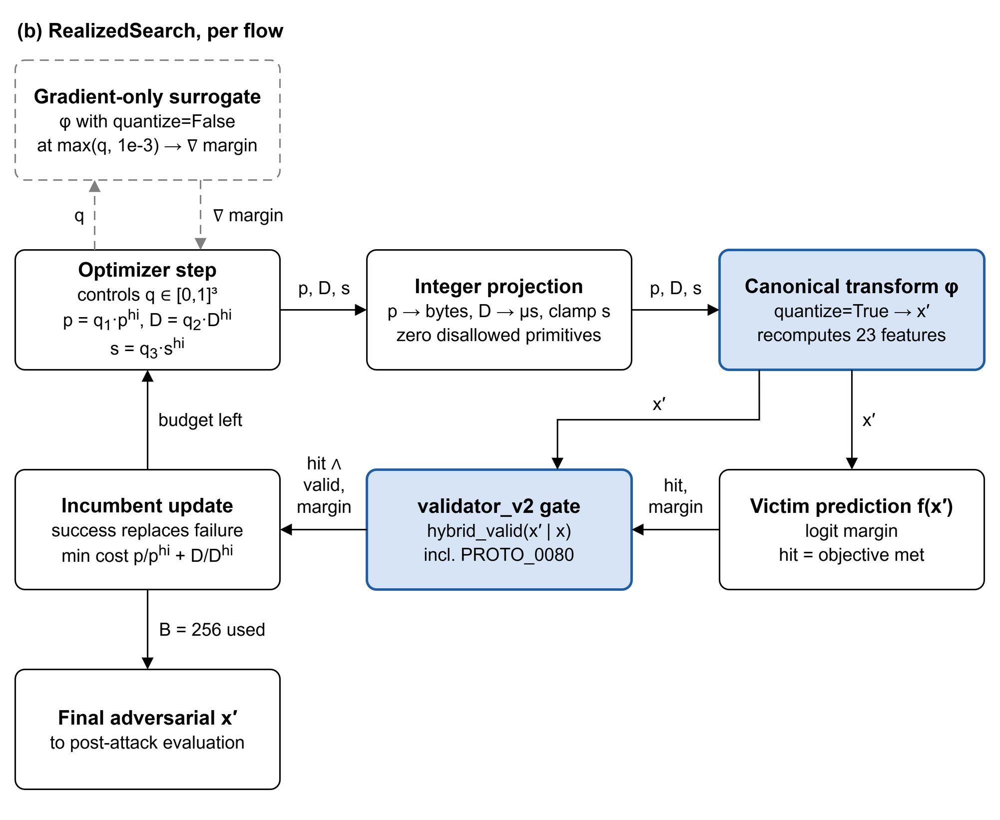
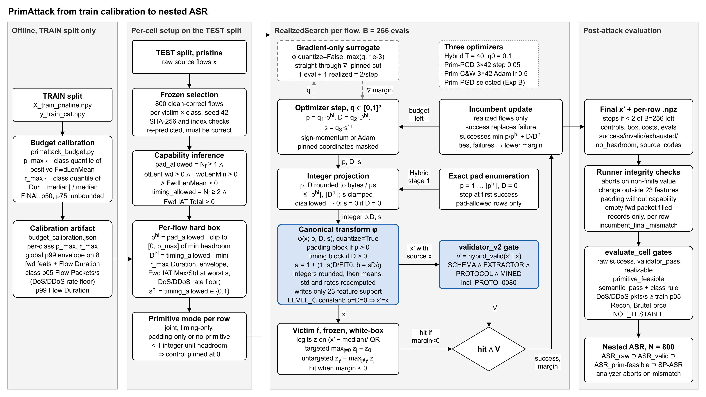

# The PrimAttack architecture

This note goes with the three PrimAttack figures in this folder. It is written for the thesis report and the defense, for readers who know adversarial machine learning but have not seen the code. Every statement follows `PrimAttack_Explained.md`, which in turn follows the code. All configurations are the locked FINAL-suite settings in `FINAL_OUTPUTS/00_PROTOCOL.md`, run by `scripts/run_final_suite.py` through `scripts/run_primattack_optimizer_ablation.py`. Since amendment A2, PrimAttack is capability-aware.

## 1. Orientation

### 1.1 What PrimAttack does

PrimAttack is a white-box evasion attack on flow-based NIDS classifiers. For each flow, the attacker chooses values for a small set of traffic primitives. A deterministic model of the flow extractor, the canonical transform $\varphi$, turns that choice into a complete and consistent 79-feature CICFlowMeter flow. The attacker never writes a feature directly; every changed feature is recomputed from the primitives by $\varphi$ (`CICIDS2017PrimitiveModel.generate`).

| Control | Meaning | Units / type | Direction |
|---|---|---|---|
| $p$ | padding added to every forward packet | integer bytes per forward packet | increase only |
| $D$ (`delay`) | total extra forward inter-arrival time | integer microseconds | increase only |
| $s$ (`shape`) | how $D$ is spread over the forward gaps ($s = 0$ proportional to the existing gaps, $s = 1$ equal per gap) | continuous, $[0,1]$ | — |

### 1.2 Threat model

The attacker has white-box access to the victim's gradients. It controls only the forward (client-to-server) direction: it can make its own packets larger and send them later. It cannot remove bytes, add or remove packets, change flags, ports or protocol, or modify the backward direction in any way. Success is measured on the realized flow, after the controls have been rounded to integer bytes and microseconds and the flow has been quantized, and that realized flow must pass validator_v2.

### 1.3 Contrast with feature-space attacks

PGD and C&W move all 79 features independently. CAPGD and C-PGD-PrimSupport move 23 features directly and encode a few relations between them as penalties (CAPGD also repairs). Because these attacks move features independently, they can reach feature combinations that no padding or delay could produce. In PrimAttack the only free variables are $(p, D, s)$, so every dependent feature changes together with the primitive that drives it.

| Aspect | PrimAttack | PGD / C&W | CAPGD / C-PGD-PrimSupport |
|---|---|---|---|
| Variables | 3 controls $(p, D, s)$ | 79 features | 23 features directly |
| Feature coupling | every dependent feature recomputed by $\varphi$ | none | a few encoded relations (penalty; CAPGD also repairs) |
| Discreteness | integer bytes and µs; realized flow quantized | ignored | integer truncation at the end |
| Per-flow capability | padding only where physically meaningful | none | none |
| Budget | train-calibrated per class + p99 envelope + rate floor | $\varepsilon$-ball | $\varepsilon$-ball + train box |
| Sees validator_v2 during search | yes, as part of the success predicate | no | no |

The last row is a deliberate threat-model difference and is documented in the protocol. PrimAttack searches with the validity gate inside its success test, while the baselines are checked for validity only after the attack.

## 2. Figure guide

### 2.1 Panel (a): end-to-end pipeline

Panel (a) has two columns. On the left, an offline column uses the TRAIN split only. Budget calibration reads it and produces the per-class caps $p_{\max}$ and $r_{\max}$, the 9-feature p99 envelope and the DoS/DDoS minimum packet-rate floor, which feed the per-flow hard box.

The right column is executed once per cell. A cell fixes the dataset, victim, source class, budget, primitive mode, attack seed and optimizer. The column runs from the frozen selection of 800 test flows, through capability inference and the per-flow hard box with its primitive mode, into the RealizedSearch loop and finally to post-attack evaluation, which reports nested ASR. Two frozen components sit beside the column. The victim $f$ feeds RealizedSearch, and validator_v2 feeds both RealizedSearch and the post-attack evaluation. validator_v2 therefore appears twice: it gates every candidate inside the search, and it checks the final $x'$ again afterwards, where every ASR shares the denominator $N = 800$.

The victim plays two more roles that the panel leaves undrawn. It decides which test flows count as clean-correct during source selection, and it scores raw success in the post-attack evaluation.

### 2.2 Panel (b): RealizedSearch for one flow

Panel (b) zooms into the search box of panel (a). The optimizer takes a step on the normalised controls $q \in [0,1]^3$. A gradient-only surrogate, drawn dashed, supplies the gradient for that step: it is $\varphi$ with `quantize=False`. The new point then travels along the realized path. It is projected to integers, passed through $\varphi$ with `quantize=True`, and the resulting flow $x'$ goes in parallel to the victim prediction $f(x')$ and to the validator_v2 gate. Both results feed the incumbent update. The loop returns to the optimizer while the flow can still afford another step, and otherwise emits the final $x'$.

The dashed styling marks the surrogate as a source of gradients only. A surrogate output can never become the incumbent; only realized, quantized flows can. The identity flow is scored first at a cost of 1, each gradient step costs 2 victim evaluations, and the cap is $B = 256$ evaluations per flow.

### 2.3 Detailed architecture

The detailed figure is a single 16:9 slide. It reads left to right through four groups: offline calibration on the training split (g0), per-cell setup (g1), the per-flow RealizedSearch, capped at $B = 256$ victim evaluations (g2), and post-attack evaluation (g3). One blue accent marks the canonical transform node and the validator_v2 gate node, the two components that make a candidate a realized and valid flow. The surrogate node and its two edges are dashed gray, and the optimizer-settings node is a dashed note.

#### Group g0: offline, train split only

The training-split node is the only data source of this group. The calibration node (`primattack_budget.calibrate`) reads `X_train_pristine.npy` and `y_train_cat.npy` and nothing else: no validation or test flows, no victim predictions, no attack outcomes. The artifact records this in `selection_prohibited_inputs`. For each attack class the node computes $p_{\max}$ as a class quantile of the positive `Fwd Packet Length Mean`, and $r_{\max}$ as a class quantile of $|\text{Flow Duration} - \text{class median}| / \text{class median}$. The quantile levels are p25, p50 and p75; the FINAL suite uses p50, p75 and an unbounded level.

The calibration-artifact node stands for `budget_calibration.json`. It holds the per-class $p_{\max}$ and $r_{\max}$, a global train p99 envelope on 9 forward-length and timing features, and two semantic thresholds: the class p05 of `Flow Packets/s` (the DoS/DDoS rate floor) and the class p99 of `Flow Duration`. The artifact is the only thing that crosses from g0 into the per-cell pipeline, along the edge into the box node.

#### Group g1: per-cell setup

The test-split node supplies pristine (unscaled) test flows. The selection node freezes 800 clean-correct flows per victim and class, drawn uniformly with selection seed 42 from flows the victim already classifies correctly. The runner reloads the list, checks its SHA-256, checks that each sample ID maps to the stored positional index, and re-predicts every row; it aborts unless every row still carries the source class and is still classified correctly. All methods, PrimAttack and baselines alike, attack exactly these flows, which makes paired McNemar tests possible.

The capability-inference node (`infer_capabilities`) decides per flow, before any optimisation, which primitives are physically meaningful, and attaches reason codes. The box node (`per_flow_bounds`) combines these capabilities with the calibration artifact into a hard box $[0, p^{hi}] \times [0, D^{hi}] \times [0, s^{hi}]$. This node has two incoming edges, one from capability inference and one from the artifact. The primitive-mode node (`_apply_primitive_mode`) restricts the box to the cell's mode and assigns each row its effective search space. Its outgoing edge leads into group g2.

#### Group g2: RealizedSearch, per flow

The optimizer-settings note lists the locked hyperparameters of the three optimizers and records that Prim-PGD was selected in Exp B. It carries no edges; it annotates the search group as a whole.

The optimizer-step node updates $q \in [0,1]^3$ with sign-momentum (Hybrid, Prim-PGD) or Adam (Prim-C&W), and masks pinned coordinates. It exchanges a two-way dashed edge with the surrogate node. Outward, the step asks for a gradient at the current $q$; back, the surrogate returns $\nabla$ margin. The surrogate evaluates $\varphi$ with `quantize=False` at $\max(q, 10^{-3})$ on free coordinates, passes the gradient straight through, and cuts the gradient path on pinned coordinates. Each surrogate call is one victim evaluation.

The step node feeds the projection node, which rounds $p$ and $D$ to integer bytes and microseconds, caps them at $\lfloor p^{hi}\rfloor$ and $\lfloor D^{hi}\rfloor$, clamps $s$, zeroes disallowed primitives and sets $s = 0$ when $D = 0$. The enumeration node also feeds projection. It is Hybrid's first stage, which tries $p = 1, \dots, \lfloor p^{hi}\rfloor$ with $D = 0$ in increasing cost order and stops at the first success; only pad-allowed rows enter it. Its candidates take the same realized path as gradient steps.

The projection node feeds the canonical-transform node, $\varphi(x; p, D, s)$ with `quantize=True`. It writes the padding block, the timing block, the recomputed rates and the integer rounding, and touches only the 23-feature write support. LEVEL_C features stay constant, and a row with $p = D = 0$ is returned unchanged.

From the transform node, two edges fan out in parallel. One reaches the victim-prediction node: the frozen white-box victim computes logits on $(x' - \text{median})/\text{IQR}$ and the targeted or untargeted margin, with a hit when the margin is negative. The other reaches the validator_v2 gate node, which computes $\texttt{hybrid\_valid}(x' \mid x)$, the conjunction of SCHEMA, EXTRACTOR, PROTOCOL and MINED, including the source-conditioned rule `PROTO_0080`. Both edges converge on the decision diamond, which declares success when the candidate is a hit and is valid.

The diamond feeds the incumbent-update node, which keeps the best realized candidate per flow by the rule in Section 3.6. Two edges leave the incumbent node. The back edge to the optimizer step, labelled with the budget condition, closes the loop while the row can afford another step. The forward edge to the final-flow node in g3 fires once the row cannot afford another step.

#### Group g3: post-attack evaluation

The final-flow node holds the adversarial flow $x'$ and the per-row `.npz` record (Section 5.4). The integrity node applies the runner's abort conditions and records `incumbent_final_mismatch`. The gates node re-evaluates the flow independently of the search through `evaluate_cell` and `FlowSemanticValidator`: raw success, `validator_pass`, `realizable`, `primitive_feasible` and `semantic_pass` with the class rules. The metrics node turns these gates into nested ASR on the same $N = 800$ flows. The analyzer that produces these metrics recomputes validator_v2 and the victim predictions from the stored flows and aborts on any mismatch. The gates score every incumbent, including those whose search failed, and an integrity failure aborts the whole run.

#### Edge summary

| From | To | Relation |
|---|---|---|
| training split | calibration | train-only input |
| calibration | calibration artifact | writes `budget_calibration.json` |
| calibration artifact | per-flow box | supplies $p_{\max}$, $r_{\max}$, envelope, rate floor |
| test split | selection | pristine test flows |
| selection | capability inference | 800 frozen clean-correct flows |
| capability inference | per-flow box | `pad_allowed`, `timing_allowed`, reason codes |
| per-flow box | primitive mode | $(p^{hi}, D^{hi}, s^{hi})$ |
| primitive mode | group g2 | effective per-row search space |
| optimizer step ↔ surrogate (dashed) | — | gradient request and $\nabla$ margin, 1 evaluation per step |
| optimizer step | projection | requested $q$, mapped to $(p, D, s)$ |
| enumeration | projection | Hybrid stage-1 padding candidates |
| projection | canonical transform | integer, capability-respecting controls |
| canonical transform | victim prediction | realized flow $x'$ |
| canonical transform | validator_v2 gate | realized flow $x'$ with its source $x$ |
| victim prediction | decision | hit |
| validator_v2 gate | decision | $V$ |
| decision | incumbent update | success flag and margin |
| incumbent update | optimizer step | loop while another step is affordable |
| incumbent update | final flow | after the last affordable step |
| final flow → integrity → gates → metrics | — | post-attack chain |

The identity evaluation (cost 1) has no node of its own; it is charged to the per-flow evaluation budget.

## 3. The mathematics

Notation: $N_f$ forward packets, $N_b$ backward packets, $N = N_f + N_b$, and $g = \max(N_f - 1, 1)$ forward gaps. $\text{FIT}_0$ is the source `Fwd IAT Total`.

### 3.1 Capability predicates

$$
\texttt{pad\_allowed} = (N_f \ge 1) \wedge (\text{TotLenFwd} > 0) \wedge (\text{FwdLenMean} > 0) \wedge (\text{FwdLenMin} > 0)
$$

$$
\texttt{timing\_allowed} = (N_f \ge 2) \wedge (\text{Fwd IAT Total} > 0)
$$

Padding adds $p$ bytes to every forward packet. When `Fwd Packet Length Min` is 0, the flow contains at least one empty forward packet, for example a pure ACK. Padding would then insert payload into an empty packet, and the aggregate features cannot say which packet is the empty one. Such flows are attacked timing-only. The padding reason codes are `NO_FORWARD_PAYLOAD`, `INSUFFICIENT_FWD_PACKETS`, `EMPTY_FWD_PACKET` and `PAD_ALLOWED`. Timing needs at least one forward gap to stretch; its reason codes are `SINGLE_FWD_PACKET`, `ZERO_TIMING_HEADROOM` and `TIMING_ALLOWED`.

In the FINAL suite only 0.03% (CICIDS2017) and 0.38% (CICIDS2018) of attacked flows may pad, and every valid PrimAttack success is timing-only.

### 3.2 The per-flow box

With $E_{(\cdot)}$ the p99 envelope value of a feature, the padding bound is

$$
p^{hi} = \texttt{pad\_allowed} \cdot \operatorname{clip}_{[0,\,p_{\max}]}\min\Big(
E_{\text{FwdMax}} - \text{FwdMax},\;
E_{\text{FwdMin}} - \text{FwdMin},\;
E_{\text{FwdMean}} - \text{FwdMean},\;
\tfrac{E_{\text{TotLenFwd}} - \text{TotLenFwd}}{N_f}\Big).
$$

The delay bound $D^{hi}$ is `timing_allowed` times the minimum of four groups of limits:

1. the class relative budget $r_{\max} \cdot \max(\text{Flow Duration}, 0.5\,\mu s)$;
2. envelope headroom on Fwd IAT Total and on Flow Duration, and $(N_f - 1)$ times the Fwd IAT Mean headroom;
3. headroom on Fwd IAT Max and Fwd IAT Std, each divided by its worst-case coefficient over all $s \in [0,1]$, so that every shape inside the box stays feasible;
4. for DoS and DDoS only, the rate floor $\text{Duration} + D \le N \cdot 10^6 / \text{minRate}$.

The shape bound is $s^{hi} = 1$ when timing is allowed and 0 otherwise. Every point of the box is feasible without a soft penalty.

The primitive mode then edits the box. `joint` keeps both primitives, `timing-only` sets $p^{hi} = 0$, and `padding-only` sets $D^{hi} = s^{hi} = 0$. Each row ends up in one effective search space (`row_primitive_modes`): `joint`, `timing-only`, `padding-only` or `no-primitive`, where the flow stays unchanged. A control with less than one integer unit of headroom is pinned at 0 and is excluded from optimisation.

### 3.3 The timing decomposition

The delay $D$ is split into a part proportional to the existing gaps and a part added equally to each gap:

$$
a = 1 + \frac{(1-s)\,D}{\text{FIT}_0}, \qquad b = \frac{s\,D}{g}.
$$

Each forward gap becomes $a \cdot \text{gap} + b$. The gaps sum to $\text{FIT}_0$, so the new total is

$$
\sum_{i=1}^{g} (a\,\text{gap}_i + b) = a\,\text{FIT}_0 + g\,b = \text{FIT}_0 + (1-s)D + sD = \text{FIT}_0 + D.
$$

The shape $s$ therefore changes how the delay is distributed and leaves the total unchanged. With $s = 0$ every gap is stretched by the same factor; with $s = 1$ every gap receives the same $D/g$. This is why `Fwd IAT Total` becomes exactly $\text{FIT}_0 + D$, `Fwd IAT Max` and `Min` become $a \cdot \max_0 + b$ and $a \cdot \min_0 + b$, and `Fwd IAT Std` becomes $a \cdot \text{std}_0$, since the uniform offset $b$ does not change the spread. `Fwd IAT Mean` is $\text{FIT}'/g$. Flow Duration becomes $\max(\text{Dur}_0 + D,\ \text{FIT}',\ \text{Bwd IAT Total},\ 0.5\,\mu s)$, Flow IAT Max grows by $\text{Dur}' - \text{Dur}_0$ (a conservative choice), and Flow IAT Mean is $\text{Dur}'/(N-1)$.

The padding block is simpler. $\text{TL}_f' = \text{TL}_f + N_f\,p$, forward min and max both shift by $p$, the forward mean and `Fwd Segment Size Avg` become $\text{TL}_f'/N_f$, and the forward standard deviation stays the same because a uniform shift preserves it. Packet-length extremes, means and the pooled variance are recomputed over both directions. The packet rates are recomputed from the new duration when $D > 0$, and Flow Bytes/s when $p > 0$ or $D > 0$.

With `quantize=True` the integer outputs are rounded (total forward length, forward min/max, Fwd IAT Total/Max/Min, Flow Duration, Flow IAT Max), and means, standard deviations and rates are recomputed from the rounded values. The realized flow then satisfies the same integer and identity constraints as a genuine CICFlowMeter row. Everything outside the 23-feature write support stays fixed: counts, flags, ports, protocol, backward statistics, header and window fields. The LEVEL_C features (Fwd Act Data Pkts, Subflow Fwd Bytes, bulk statistics, Flow IAT Std and Min, all Active/Idle statistics) would change under real packet edits but cannot be reconstructed from aggregates, so they are held constant.

### 3.4 Normalised controls

The optimizers work on $q \in [0,1]^3$ with

$$
p = q_1\,p^{hi}, \qquad D = q_2\,D^{hi}, \qquad s = q_3\,s^{hi}.
$$

The box becomes the unit cube for every flow. Coordinates with no headroom are masked to 0.

### 3.5 Margins

With logits $z$ on the scaled realized flow, lower margins are better and a negative margin means the objective is met:

$$
\text{targeted} \to \text{Benign}: \quad m = \max_{j \ne 0} z_j - z_0, \qquad \text{hit} \iff \arg\max_j z_j = 0,
$$

$$
\text{untargeted}: \quad m = z_y - \max_{j \ne y} z_j, \qquad \text{hit} \iff \arg\max_j z_j \ne y.
$$

A candidate succeeds when it is a hit on the realized flow and $V = \texttt{hybrid\_valid}(x' \mid x) = 1$.

### 3.6 The incumbent rule

`_candidate_take` keeps one incumbent per flow:

1. a success always replaces a failure;
2. among successes, the lowest normalised cost $p/p^{hi} + D/D^{hi}$ wins, with ties going to the lower margin;
3. among failures, the lowest margin wins.

Only realized, quantized flows are candidates. Surrogate points supply gradients and are never stored.

### 3.7 Evaluation budget

Every victim forward pass counts, on a realized flow or on the surrogate. Per flow, the identity flow costs 1, each gradient step costs 2 (one surrogate forward with its backward pass, one realized evaluation), and the cap is $B = 256$. A row stops once it cannot afford another step. Prim-PGD's schedule follows from this:

$$
\Big\lfloor \frac{256 - 1}{2 \cdot 3} \Big\rfloor = 42 \text{ steps per restart}, \qquad 1 + 3 \cdot 42 \cdot 2 = 253 \le 256.
$$

### 3.8 Nested ASR

Over the same $N = 800$ attempted flows per victim and class, with $S_i$ the raw success and $V_i$ the validator_v2 verdict of flow $i$,

$$
\text{ASR}_{\text{raw}} \;\supseteq\; \text{ASR}_{\text{valid}} = \tfrac{1}{N}\textstyle\sum_i S_i V_i \;\supseteq\; \text{ASR}_{\text{prim-feasible}} \;\supseteq\; \text{SP-ASR}.
$$

## 4. The three optimizers and the selection rule

All three optimizers run inside the same `RealizedSearch` object. It owns the attack space, the success definition and the query accounting, so the optimizers differ only in how they move $q$.

| Optimizer | Function | Method | Locked settings |
|---|---|---|---|
| Hybrid | `optimize_primitive_candidates` | exact padding enumeration, then adaptive sign-momentum refinement with restarts until the budget is used | $T = 40$ steps/restart, $\eta_0 = 0.1$, momentum 0.75; every 10 steps, step halving and reset to the restart's best point for flows whose best margin in the current restart has not improved |
| Prim-PGD | `optimize_primitive_pgd` | fixed-step projected sign-momentum descent on the margin | 3 restarts × 42 steps, step 0.05, momentum 0.75 |
| Prim-C&W | `optimize_primitive_cw` | projected Adam on cost + hinge, binary search on $c$ | 3 stages × 42 Adam steps, lr 0.5, $c_0 = 1$, $\kappa = 0$, betas (0.9, 0.999) |

Hybrid first enumerates $p = 1, 2, \dots, \lfloor p^{hi}\rfloor$ with $D = 0$ in batches, in increasing cost order, and a flow stops at its first success because larger padding can only cost more. This solves padding-only rows exactly; in the FINAL suite almost no flow may pad, so the stage is almost always skipped at zero cost. Flows that are still unsuccessful and have delay headroom then enter adaptive refinement. Restart 0 starts from the best point found so far and later restarts start uniformly at random in the box. Each step normalises the surrogate gradient by its mean absolute value over the free coordinates, updates $v \leftarrow 0.75\,v + g$, moves $q \leftarrow \operatorname{clip}_{[0,1]}(q - \eta\,\operatorname{sign}(v))$, masks pinned coordinates and scores the new point on the realized path. Every $\max(5, T/4) = 10$ steps, a flow whose best margin in the current restart has not improved gets $\eta$ halved, $q$ reset to the restart's best point, and its momentum cleared.

Prim-PGD drops enumeration, step adaptation and the reset. Restart 0 starts at the clean flow ($q = 0$) and restarts 1 and 2 start uniformly at random. Each step applies $v \leftarrow 0.75\,v + g/\overline{|g|}$ and $q \leftarrow \operatorname{clip}(q - 0.05\,\operatorname{sign}(v))$, then scores on the realized path.

Prim-C&W minimises

$$
\mathcal{L}(q) = q_p + q_D + c \cdot \max(\text{margin} + \kappa,\ 0)
$$

with a per-flow binary search over $c$ in the manner of Carlini and Wagner. Each stage restarts from the clean flow. After a stage with a realized success, $c$ moves towards the lower bracket; otherwise $c$ is multiplied by 10, or bisected once an upper bracket exists. The learning rate 0.5 was chosen on the validation split.

The selection rule was pre-registered for Exp B. It picks the highest aggregate Valid Targeted ASR at p75, pooled over both datasets and all victims, classes and seeds as the sum of valid successes over the sum of attempts. Ties go to fewer mean victim evaluations per flow, then to the fixed order Hybrid, Prim-PGD, Prim-C&W. p-values play no role.

Hybrid and Prim-PGD tied exactly at 1,752 / 57,600 valid targeted successes. Almost every row is timing-only, so Hybrid's padding stage never runs and both optimizers reduce to similar sign-momentum searches over delay and shape. Prim-PGD was selected because it used fewer evaluations, 188.5 against 189.6 mean per flow.

## 5. Post-attack evaluation

### 5.1 Gates

The incumbent flow is re-evaluated independently of the search by `evaluate_cell` and `FlowSemanticValidator.evaluate`.

| Gate | Checker | What it checks |
|---|---|---|
| Raw success | victim | targeted: $\arg\max = $ Benign; untargeted: $\arg\max \ne y$ |
| `validator_pass` (`hybrid_valid`) | validator_v2 | SCHEMA ∧ EXTRACTOR ∧ PROTOCOL ∧ MINED, given the source flow |
| `realizable` | `RealizabilityValidator` | the model's own identities, packet-length ordering, non-negative rates, integer features integral, frozen features unchanged |
| `primitive_feasible` | `FlowSemanticValidator` ∧ realizable | projected $p$, $D$ are integers inside the box; $s \in [0, s^{hi}]$; relative duration change within budget; bytes not decreased |
| `semantic_pass` | `FlowSemanticValidator` | label, protocol, ports, packet counts, flags and IP endpoints unchanged; values finite; only dependencies of active primitives changed; the class rule |

### 5.2 Class rules

For DoS and DDoS, `Flow Packets/s` must stay at or above the class train p05; a DoS flow slowed below that rate would no longer be a credible DoS flow. For Recon and BruteForce, the critical properties (the scanned port set and scan order; authentication attempts and outcomes) cannot be observed in flow data and are recorded as `NOT_TESTABLE`. These two classes can never reach semantic status `PASS`, so their SP-ASR is 0 by construction.

### 5.3 Runner integrity checks

The runner aborts if any output value is non-finite, if any feature outside the 23-feature support changed, if padding was applied to a flow without padding capability, or if an empty forward packet was filled. For every row it also records `incumbent_final_mismatch`, which flags disagreement between the search's own success flag and the recomputed final success.

### 5.4 Stored artifacts

Each per-row `.npz` file stores the final adversarial raw flow, the controls, the box, the costs, the evaluation counts, the candidate source, the failure reason (`success`, `invalid`, `exhausted` or `no_headroom`) and the capability reason codes. The analyzer recomputes validator_v2 and the victim predictions from these stored flows and aborts on any mismatch. Budget calibrations live in `artifacts/primattack/budget_calibration.json` (CICIDS2017) and `artifacts/primattack/budget_calibration_cicids2018.json`; the frozen selections live in `FINAL_OUTPUTS/runs/<dataset>/baselines_untargeted/selection.json`.

## 6. PrimAttack in the FINAL suite

| Stage | Experiment | PrimAttack configuration |
|---|---|---|
| `primattack_targeted_optimizers` | B | Hybrid / Prim-PGD / Prim-C&W, targeted → Benign, p75, joint |
| optimizer selection | B | pre-registered rule → Prim-PGD |
| `primattack_targeted_budgets` | C | top-2 optimizers at p50 and unbounded (p75 cells reused from B) |
| `primattack_untargeted` | A, D | selected optimizer, untargeted, p75 (+ unbounded, descriptive) |
| `primattack_untargeted_modes` | A (primitive ablation) | same configuration restricted to timing-only and padding-only |

Every stage uses attack seeds 42, 2024 and 2026, the classes DoS, DDoS, Recon and BruteForce, and the victims MLP, CNN and FT-Transformer. The CICIDS2018 victims are the training-seed-42 checkpoints.

The headline figure is untargeted Valid ASR for Prim-PGD at p75 (`FINAL_OUTPUTS/final_experiment_summary.md`):

| Victim | CICIDS2017 | CICIDS2018 |
|---|---|---|
| MLP | 4.09% | 2.53% |
| CNN | 13.47% | 1.16% |
| FT-Transformer | 0.12% | 0.00% |

Raw ASR equals Valid ASR in every PrimAttack cell with successes. PGD and C&W reach 53.59–100% raw ASR and 0% valid ASR, and CAPGD and C-PGD-PrimSupport reach large raw ASR with little or no valid ASR.

Exp C runs the targeted → Benign attack of Exp B at p50, p75 and an unbounded budget, and all its figures are Valid Targeted ASR. The CICIDS2017 CNN, for instance, reaches 13.25% targeted at p75, against the 13.47% untargeted in the table above. Valid Targeted ASR never decreases as the budget grows. For Prim-PGD on CICIDS2017 it rises from 2.31% (p50) to 4.09% (p75) and 22.94% (unbounded) for the MLP, and from 9.19% to 13.25% and 59.69% for the CNN. The unbounded (envelope-only) level sets $p_{\max} = r_{\max} = \infty$ and keeps the p99 envelope and the DoS/DDoS rate floor, so the primitives are limited by physical plausibility alone. The targeted p75 values of 4.09% and 13.25% are conservative results at a calibrated budget and do not bound timing-based evasion. The FT-Transformer stays at or below 0.59% under any PrimAttack budget.

Amendment A2 made PrimAttack capability-aware. The pre-fix relaxed-padding run reached 11.06% / 36.67% / 0.50% Valid ASR on CICIDS2017, mostly by filling empty forward packets. It is kept only as a non-canonical record in `FINAL_OUTPUTS/superseded_relaxed_padding/`.

## 7. Claim boundaries

All results are proxies on aggregate CICFlowMeter features. No PCAP is edited, replayed or re-extracted (`attack/realizability/base.py:NullPacketBackend`), and the thesis claims neither packet-level realizability nor complete malicious functionality.

The LEVEL_C features (Flow IAT Std/Min, Active/Idle, bulk, subflow, Fwd Act Data Pkts) are held constant because aggregates cannot say how they would change under real packet edits. The thesis does not show that they are invariant.

The padding rule is conservative. Requiring `Fwd Packet Length Min > 0` gives up possibly legitimate padding of data packets in flows that mix empty and data packets.

The semantics of Recon and BruteForce cannot be tested from flow data, so these classes have SP-ASR 0 by construction.

Valid evasion depends on the victim and on the budget. The FT-Transformer stays at or below 0.59% under any PrimAttack budget, while the CICIDS2017 CNN reaches 13.47% at p75.

The seeds 42, 2024 and 2026 vary only the attack, on one frozen victim per architecture; victim-training seeds were not varied. Each victim is reported separately and never pooled.

## 8. Code map

| File | Concern |
|---|---|
| `src/attack/primattack_budget.py` | train-only budget calibration |
| `src/attack/realizability/cicids2017.py` (`CICIDS2017PrimitiveModel`) | primitive specs, capabilities, box, projection, $\varphi$ |
| `src/attack/realizability/cicids2017.py:primattack_joint_feature_mask` | 23-feature write support |
| `src/attack/primitive_optimizer.py` | `RealizedSearch` harness, Hybrid, Prim-PGD, Prim-C&W |
| `src/attack/run_cicids2017_primitive_attack.py` (`_apply_primitive_mode`, `evaluate_cell`) | primitive modes, cell evaluation |
| `src/attack/realizability/validator.py` | internal realizability checks |
| `src/attack/flow_semantics.py` | semantic and primitive-feasibility checks |
| `validation/attack_interface.py:structural_masks`, `primitive_optimizer.py:hybrid_valid_gate` | validator_v2 gate |
| `scripts/run_primattack_optimizer_ablation.py` (driven by `scripts/run_final_suite.py`) | FINAL runner |
| `scripts/analyze_final_suite.py` → `FINAL_OUTPUTS/` | analysis |
