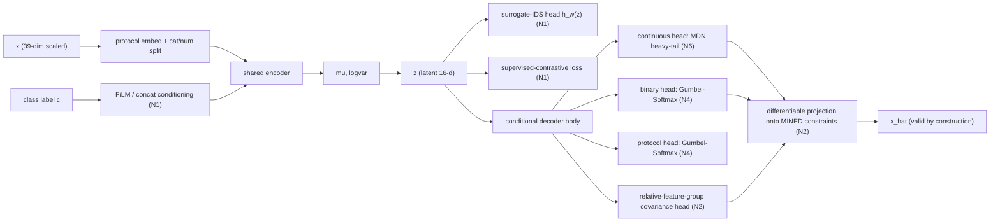
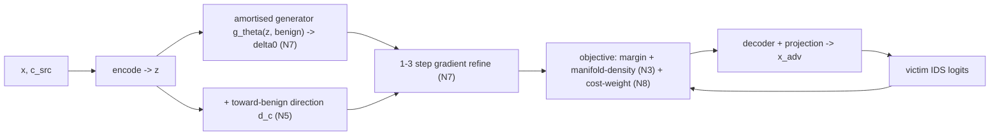

# `new_vae_plan.md` — Novel VAE + Attack Plan (N1–N8)

*Actionable design/implementation plan that turns the analysis in
`vae_attack_loop_explained.md` into a concrete, defensible, novel system. This file is the
"what to build and why"; the explainer is the "what exists and what the literature says".*

*Forward-looking effect estimates are marked `[INFERENCE]`. Every design choice cites the
literature that grounds it. Repo conventions from `CLAUDE.md` are respected: fit on TRAIN only,
one pipeline stage per commit, keep old constants until the replacement is validated, global
`SEED=42`, verify behavioural changes by running the metric.*

---

## 0. Verdict (read first)

- **Current VAE is not defensibly novel** — it is a domain port of He's mixed-input tabular VAE
  (`arXiv 2507.10998`): per-class split + protocol embedding + hand-coded structured decoder. A
  reviewer's rebuttal: *"you ported He's VAE to NIDS and hard-coded CICIoT2023 rules."*
- **He's own novelty is novelty-by-combination** (first VAE-latent on-manifold attack for *tabular*
  data + the latent classifier head `h_ω` + the IDSR metric). That is the exact bar you must clear.
- **This plan clears it** via a conjunction no prior work occupies. **Minimum viable novelty (MVN) =
  N1 + N2.** Everything else raises ASR/IDSR/speed and strengthens the story.

**One-sentence claim (the thing to defend):**
> A **conditional, supervised-contrastive, mixed-input VAE** for constrained **IoT NIDS
> (CICIoT2023)** whose decoder enforces **mined** domain constraints by **differentiable
> projection**, attacked in **latent space** with a **manifold-density-in-the-loop, cost-weighted**
> objective and an **amortised one-shot generator** — evaluated by **validity-gated IDSR** and
> **per-sample latency**.

---

## 1. Positioning — why this intersection is empty

| Work | Generative model | Domain | Constraints | Latent attack | Density-native (IDSR) | Speed story |
|---|---|---|---|---|---|---|
| He (2507.10998) | single VAE + `h_ω` | general tabular | none | ✅ C&W | ✅ Mahalanobis | ❌ 300-iter/sample |
| NetDiffuser (2603.08901) | diffusion | NIDS flow | feature partition | ❌ | partial | ❌ T-step chain |
| CaFA (2501.10013) | none (TabPGD) | tabular | **mined** denial-constraints (projection) | ❌ input-space | ❌ | medium |
| CAA (2406.00775) | none | tabular | mutability/bounds + **search** | ❌ | ❌ | ❌ evolutionary |
| IDSGAN / attackGAN | GAN (black-box) | NIDS | restricted-modification mask | ❌ | ❌ (no density) | fast, no validity |
| **This plan** | **conditional VAE** | **IoT NIDS** | **mined + projection + cost** | ✅ | ✅ | ✅ **amortised O(1)** |

**Do NOT claim** constraints add robustness — Sheatsley (`2011.01183`, CCS'21 `2105.08619`) shows
they don't (≥95% evasion with ~5 mutable features). Frame the contribution as *realistic,
efficient, on-manifold evasion*, not defense.

---

## 2. Target architecture



Attack side:



---

## 3. The changes (N1–N8)

Each: **What · Why (lit) · How (files) · Expected effect `[INFERENCE]` · Differs from He · Risk/fallback · Priority.**

### N1 — Conditional + supervised-contrastive latent with surrogate-IDS head  *(ARCHITECTURE, P0)*
- **What.** One **class-conditional VAE** (condition on 8-way label via FiLM or concat on encoder &
  decoder) replacing the 8 per-class VAEs; add a latent head `h_ω(z)` (CE) and a **supervised
  contrastive** loss on `z` (pull same-class, push different-class).
- **Why.** He shows `α·L_cls` is what makes latent attacks work (α=0 ablation degrades everything);
  the repo deleted it *and* split per-class, so no latent knows the decision boundary. SupCon
  (Khosla `2004.11362`) is the standard tool for separated, smooth class manifolds; Stutz shows
  on-manifold adversarials live on class-aligned manifolds.
- **How.** `src/vae/model.py` (add conditioning + `h_ω`), `src/vae/losses.py` (add `L_cls` +
  contrastive terms), `src/vae/config.py` (α, contrastive weight/temp), `src/vae/train.py` /
  `train_all.py` (one model, label-conditioned loaders). `src/attack/*` load one model + class id.
- **Effect.** Small in-distribution latent moves cross the boundary → **higher ASR at smaller ε →
  lower outlier rate → higher IDSR.** Root-cause fix for weak latent ASR.
- **Differs from He.** He is *unconditional* and *explicitly forgoes* a conditional VAE (untargeted);
  yours is conditional + contrastive + supports **targeted-benign** (the real IDS threat).
- **Risk R1 — reverses locked decision.** Single VAE reverses "8 per-class β-VAEs" in `CLAUDE.md` →
  **advisor sign-off needed (§8)**.
- **Risk R2 — 8-class multimodality + imbalance ruining a single VAE.** A *plain* single VAE would
  mode-average across DoS/DDoS/Web/Recon/Mirai/Spoofing/BruteForce/Benign, and the **72.65%-DDoS**
  train imbalance (see `feature_groups_and_netdiffuser_audit.md`) would swamp minority classes
  (Web, BruteForce) → blurry minority reconstruction → high `O_r` → low IDSR. **This is the main
  N1 risk.** Mitigations, in escalation order:
  1. **Conditioning does the heavy lifting.** A *conditional* VAE learns `p(x|z,c)` (Sohn 2015): the
     decoder receives label `c`, so between-class multimodality is carried by `c`, not squeezed into
     one unconditional `z`. Within-class multimodality → `z` + the N6 mixture decoder.
  2. **Class-balanced training:** balanced sampling or class-weighted reconstruction (reuse the
     existing protocol class-weight machinery) + per-class free-bits, so DDoS cannot dominate.
  3. **Mixture-of-experts decoder (strong middle ground):** shared conditional encoder + latent, but
     **per-class decoder expert branches gated by `c`** → inter-class latent geometry for the attack
     with **zero cross-class reconstruction averaging**.
  4. **Fallback N1′:** keep the 8 per-class decoders untouched; align only their **encoders into one
     shared latent frame** via inter-class contrastive + a small shared `h_ω`. Zero reconstruction
     risk, weaker attack geometry.
  **Counterpoint (why single can be *better* for rare classes):** per-class VAEs starve Web/
  BruteForce of data (few samples each → worst reconstructors); a conditional/shared model lets them
  borrow the common flow manifold. He's own finding: attack quality needs reconstruction quality
  **and** sufficient data — which favours sharing for rare classes.
  **Empirical gate (decide by measurement, not faith):** the ablation ladder logs **per-class
  reconstruction + `O_r`**. Ship CVAE + balancing; if *any* class regresses vs the per-class
  baseline, escalate 1→2→3→4. Detect the failure, don't bet on it.

### N2 — Relative-group decoder + differentiable projection onto mined constraints  *(ARCHITECTURE, P0)*
- **What.** Replace hand-coded structured-decoder rules with two learned/principled pieces:
  (a) model NetDiffuser **relative** groups with a **joint covariance head** (low-rank `Σ=LLᵀ+D` or
  small autoregressive/coupling head); (b) a **differentiable projection layer** as the decoder's
  final stage that projects onto the feasible set defined by **mined** constraints.
- **Why.** CaFA (`2501.10013`) mines denial/integrity constraints and enforces by projection;
  differentiable-projection layers (`2111.10785`, `2105.08881`) give hard constraints with
  gradients. Matches the repo's own `ConstraintMiner→MinedValidator` refactor principle
  (constraints mined on TRAIN, not hand-authored). He et al.'s seven imperceptibility properties
  include **feature interdependencies**.
- **How.** New `src/vae/projection.py` (projection layer); `src/vae/model.py` decoder tail;
  consume mined constraints from the planned `FeatureManifold` (fall back to current
  `netdiffuser_categorization.json` + G1–G8 until the miner exists). Keep the softplus repairs
  in-tree until projection is proven equal/better (`CLAUDE.md` rule).
- **Effect.** Validity by construction → the validity gate stops discarding samples; tighter/more
  complete mined rules → **lower outlier rate → higher IDSR**; cleaner independent knobs for the
  attacker.
- **Differs from He / CaFA.** He has no constraints; CaFA projects in **input space** post-hoc on a
  general classifier. Projection **inside a VAE decoder**, over **mined NIDS** constraints, feeding
  a **latent** attack, is the novel combination — and the piece that reads as a real *architecture*
  contribution, not a port.
- **Risk/fallback.** Non-convex constraint set (G5 ordering ∧ G6 var=std² ∧ mined) → projection may
  be non-convex/unstable. Fallback: keep by-construction softplus repairs for the non-convex
  subset; project only the box/convex part.

### N3 — Manifold-density-in-the-loop attack objective  *(ATTACK, P1)*
- **What.** Add a differentiable in-distribution penalty to latent PGD/C&W:
  `L = L_classifier + γ·Mahalanobis²(z_adv | c)` (+ optional GMM log-density), using the per-class
  μ,Σ / GMM already fit. Keep the ε-ball as a hard backstop.
- **Why.** He's IDSR and NetDiffuser's goal *are* "misclassify **and** stay in-distribution / evade
  the manifold detector (MANDA/Artifact/NIDS-DA)." The repo measures Mahalanobis but never
  optimises it.
- **How.** `src/attack/latent_pgd.py`, `latent_cw.py` (add penalty term); reuse
  `MahalanobisOutlierDetector` / `latent_gmm.py`.
- **Effect.** Trades a little raw ASR for a large outlier-rate drop → **higher IDSR**; adversarials
  survive the realism gate instead of being discarded post-hoc; enables a **detector-evasion**
  result.
- **Differs from He.** He optimises `margin + ‖δ‖` only. A manifold-density regulariser *inside the
  optimiser* directly answers "does your attack beat a manifold detector?"
- **Risk/fallback.** γ too high suppresses ASR — sweep γ; report the ASR–IDSR trade curve.

### N4 — Fast differentiable discrete heads (Gumbel-Softmax) — replaces CAA's slow search  *(ATTACK, P1)*
- **What.** Relax protocol softmax + 11 binary logits with **Gumbel-Softmax/Concrete**
  (`1611.01144`, `1611.00712`) under a temperature anneal, so discrete flips are optimised **by
  gradient, one pass/step** — no search, no population.
- **Why.** CAA shows discrete/constrained features are why gradient-only tabular attacks
  under-perform, but it pays with **slow** evolutionary search (MOEVA) — which kills a speed claim.
  Gumbel-Softmax gets the benefit at gradient speed; it also strictly upgrades the current crude
  straight-through binary path.
- **How.** `src/vae/model.py:decode_to_39` attack path (replace sigmoid/STE + frozen-protocol path,
  protocol only if the threat model permits it); anneal τ→0 across attack steps.
- **Effect.** Recovers misclassifications reachable only via a discrete flip STE misses; lower-bias
  gradient than STE. **No speed loss.**
- **Differs from He / CAA.** He: no discrete mechanism. CAA: slow search. Gumbel-Softmax discrete-
  head latent attack is faster than CAA and novel in this setting.
- **Risk/fallback.** Relaxation bias near τ>0 → anneal + a final hard-decode validity check.

### N5 — Learned "toward-benign" latent direction (targeted-benign)  *(ATTACK, P2)*
- **What.** From N1's conditional/contrastive latent, estimate a per-source-class direction `d_c`
  toward Benign (class-centroid delta or latent LDA); use it to warm-start / bias the attack
  (extra restart seed alongside GMM).
- **Why.** The operative IDS threat is malicious→benign (false negative) — the NetDiffuser /
  problem-space target. He's attack is untargeted.
- **How.** `src/attack/latent_restarts.py` (add `d_c` seed), `latent_pgd.py`/`latent_cw.py`
  (targeted-benign path already exists).
- **Effect.** Benign-oriented warm start needs far less perturbation to cross → higher
  targeted-benign success at lower ε → higher IDSR.
- **Differs from He.** He avoids conditioning/targeting; targeted-benign latent traversal on a
  conditional manifold is novel and threat-aligned.
- **Risk/fallback.** If `d_c` overshoots off-manifold, cap its magnitude and let refinement finish.

### N6 — Heavy-tail likelihood + activate physics  *(ARCHITECTURE, P2 supporting)*
- **What.** Replace the continuous head's point-Gaussian with a **2–3 component mixture density
  (MDN)** (or keep Laplace) for heavy-tailed features (Rate/IAT/Tot sum); turn on the dormant
  physics decoder/loss (P2/P4/P5).
- **Why.** He's own finding: VAE-attack quality is bounded by **reconstruction quality**; outlier
  rate is dominated by heavy right tails. Physics rules already exist but are off
  (`physics_constraint_loss_weight=0.0`, `use_structured_physics_decoder=False`).
- **How.** `src/vae/model.py` (MDN head), `losses.py` (MDN NLL), `config.py` (enable physics).
- **Effect.** Lower `O_r` → higher IDSR; better clean-data validity/fidelity.
- **Differs from He.** He uses a single Gaussian; MDN + physics is NIDS-specific realism.
- **Risk/fallback.** MDN adds instability — keep Laplace as the safe default if MDN doesn't converge.

### N7 — Amortised one-shot perturbation generator (headline speed novelty)  *(ATTACK, P1)*
- **What.** Train a small conditional generator `g_θ(z, c_src→benign) → δ` (advGAN-style,
  `1801.02610`; cf. Natural AEs `1710.11342`). Inference = **one forward pass**; recover per-sample
  slack with **1–3 gradient refinement steps** on top.
- **Why.** Amortised generators give **O(1)** inference — orders faster than He's 300-iter C&W,
  NetDiffuser's T-step chain, and CAA's search. Learned-init + few-step-refine keeps ASR high.
- **How.** New `src/attack/amortized_generator.py` + a training entry; reuse the N3/N8 objective as
  `g_θ`'s training loss; refinement reuses `latent_pgd.py`.
- **Effect.** Same/near ASR-IDSR at **O(1) inference**; this is the **speed claim** (measure it).
- **Differs from He / NetDiffuser.** Both are per-sample iterative; an amortised conditional latent
  perturbation generator for constrained NIDS is architecturally distinct.
- **Risk/fallback.** Amortised ASR < iterative → report both; the +refine hybrid closes the gap.

### N8 — Cost/utility-weighted perturbation (replaces the binary mask)  *(THREAT MODEL, P2)*
- **What.** Replace/augment the 3-tier mutable/partial/frozen mask with a **per-feature cost vector
  `c_f`**; attack minimises `L_classifier + Σ_f c_f·|Δ_f|` (`c_f=∞` = immutable). Derive `c_f` from
  real attacker effort (IAT/rate cheap; protocol/service expensive).
- **Why.** Kireev (`2208.13058`, NDSS'24) and Mathov argue cost/utility is the right tabular threat
  model; fills the **missing formal threat model** flagged in `old_root_files/IMPROVEMENTS.md`.
- **How.** `src/attack/latent_infra.py` (cost vector alongside `PerturbationMask`), attack objective
  in `latent_pgd.py`/`latent_cw.py`.
- **Effect.** Budget flows to cheap, realistic features → higher **realistic** ASR at lower cost +
  a defensible economic threat model.
- **Differs from He.** He uses ℓ_2 only; cost-weighted latent NIDS attack is novel.
- **Risk/fallback.** Cost values are subjective → derive from data/domain and run a sensitivity
  sweep; keep the binary mask as `c_f∈{0,∞}` special case for comparability.

---

## 4. Training objective (consolidated)

```
L_total =  recon_continuous(MDN | Laplace, N6)            # per-feature NLL, heavy-tail
         + recon_binary (BCE)                              # 11 independent binaries
         + protocol_loss_weight · recon_protocol (CE)      # 6-way
         + β · KL         (free-bits λ=0.1, β=0.5)          # anti-collapse (keep)
         + α · L_cls(h_ω(z), y)                             # N1 surrogate-IDS head
         + μ · L_supcon(z, y)                               # N1 supervised contrastive
         + (relative-group covariance NLL)                 # N2
         + (projection is by-construction, not a loss)     # N2 (replaces soft constraint loss)
         + [physics P2/P4/P5]                               # N6 (activate)
```
Keep the existing differentiable constraint loss **only** for the non-convex subset not covered by
the projection layer (transition period).

---

## 5. Evaluation & ablation ladder

Report each rung as **ΔASR, ΔO_r (outlier), ΔIDSR** vs the previous rung, **plus per-sample
wall-clock + forward-eval count** so novelty is causally attributed and speed is quantified.

| Rung | Config | Primary metric watched |
|---|---|---|
| 0 | current per-class VAE + latent PGD/C&W (reproduce He-style IDSR) | baseline |
| 1 | +N1 (conditional + `h_ω` + contrastive) | ASR ↑ (largest) |
| 2 | +N2 (relative-group + mined projection) | O_r ↓, validity ↑, IDSR ↑ |
| 3 | +N3 (manifold-in-loop) | IDSR ↑; detector-evasion (MANDA-style) |
| 4 | +N4 (Gumbel-Softmax discrete) | ASR ↑, no speed loss |
| 5 | +N5 (toward-benign) | targeted-benign IDSR ↑ |
| 6 | +N6 (MDN + physics) | O_r ↓, fidelity ↑ |
| 7 | +N7 (amortised + refine) | ~equal IDSR at **O(1)** latency |
| 8 | +N8 (cost-weighted) | realistic ASR ↑, threat-model realism |

**Metrics:** `ASR_raw`, protocol validity, mask/cost compliance, raw G1–G8 validity, joint
validity, IDR (Mahalanobis), **True-IDSR = mean(evasion ∧ joint_valid ∧ in_distribution)** (fix the
defective `he_idsr` per `CLAUDE.md`), TabAttackBench axes (Proximity, Sparsity, Deviation,
Sensitivity), and **per-sample latency / eval count**. Add a **detector-evasion** panel (train a
Mahalanobis/MANDA-style detector; report AUC drop) to cash the N3 claim.

---

## 6. Threat model (state explicitly — currently missing)

| Component | Choice |
|---|---|
| Goal | Evasion; primarily **targeted-benign** (malicious→benign false negative) |
| Knowledge | White-box gradients on a surrogate IDS (transfer to the 4 neural baselines) |
| Control | **Cost-weighted** feature mutability (N8); protocol/derived-bits immutable by default |
| Constraints | Mined domain constraints + G1–G8 + protocol allowlist, enforced by projection (N2) |
| Success | Misclassification **∧** joint validity **∧** in-distribution (True-IDSR) |
| Efficiency | Reported as a first-class axis (N7) |

---

## 7. Implementation roadmap (one stage per commit; verify by running the metric)

- **Phase A — MVN architecture (P0):** N1 (or N1′) → retrain; N2 projection decoder (mined
  constraints from existing artifacts first). Gate: ΔASR from N1, Δvalidity/ΔIDSR from N2.
- **Phase B — attack objective (P1):** N4 (Gumbel-Softmax) → N3 (manifold-in-loop) → N7 (amortised
  + refine). Gate: ASR ↑ (N4), IDSR ↑ + detector-evasion (N3), latency ↓ (N7).
- **Phase C — realism & threat model (P2):** N6 (MDN+physics) → N5 (toward-benign) → N8 (cost).
  Gate: O_r ↓, targeted-benign IDSR, cost-sensitivity sweep.
- **Phase D — write-up:** ablation table, ASR–IDSR trade curves, latency table, threat model,
  positioning vs He/NetDiffuser/CaFA/IDSGAN, Sheatsley caveat.

Respect: fit miners/GMM/Mahalanobis/scalers on **TRAIN** (note where VAL is used for
calibration); keep old hand-coded rules/mask in-tree until the mined/projection replacement is
proven equal-or-better; seed everything (`SEED=42`).

---

## 8. Decision needed from advisor (blocking N1)

**Per-class β-VAEs is a locked decision in `CLAUDE.md`.** N1 (single conditional VAE) reverses it
and is the biggest ASR lever. Choose:
- **Option A (recommended):** single **conditional** VAE (N1) + class-balancing — strongest novelty
  + ASR, but retrains from scratch and rewrites loaders/attack wiring. Risk R2 (multimodality/
  imbalance) mitigated by conditioning + balancing.
- **Option A2 (middle ground):** conditional encoder/latent + **mixture-of-experts decoder**
  (per-class expert branches) — inter-class attack geometry with no cross-class reconstruction
  averaging; safest way to keep single-model novelty if minority reconstruction regresses.
- **Option B (conservative):** keep per-class decoders, do **N1′** (shared latent frame + inter-class
  contrastive + shared `h_ω`) — preserves the locked decision, weaker but still novel.

Everything else (N2–N8) is compatible with either option.

---

## 9. Scope guardrails / what NOT to claim

- **Not** "a brand-new VAE primitive." Claim **novelty by conjunction + mined-projection decoder +
  IoT/density-native/speed** — the same class of novelty He himself claimed.
- **Not** "constraints make the IDS robust" (Sheatsley refutes it).
- **Not** problem-space/packet-level realism — this is **flow/feature-level**; state it as a scope
  limit and map cost weights (N8) to plausible packet-level actions where possible.
- Lead with **VAE-latent + mined-projection decoder**, not "constraint mining" alone (CaFA precedence).

---

## 10. Reference index
He VAE-TabAttack `2507.10998`; NetDiffuser `2603.08901`; CaFA `2501.10013`; CAA `2406.00775` /
`2311.04503`; Kireev cost/utility `2208.13058`; systematic review `2506.15506`; SoK NIDS
`2308.06819`; Sheatsley `2011.01183` / `2105.08619`; unified constrained feature space `2112.01156`;
problem-space NIDS `2403.11830`; IDSGAN `1809.02077`; Attack-GAN `2103.04794`; advGAN `1801.02610`;
Natural AEs `1710.11342`; Gumbel-Softmax `1611.01144` / `1611.00712`; SupCon `2004.11362`;
differentiable projection `2111.10785` / `2105.08881`; constrained tabular diffusion `2606.28674` /
`2506.12911`. Full prose in `vae_attack_loop_explained.md` (Parts E, E2, G, G2).
